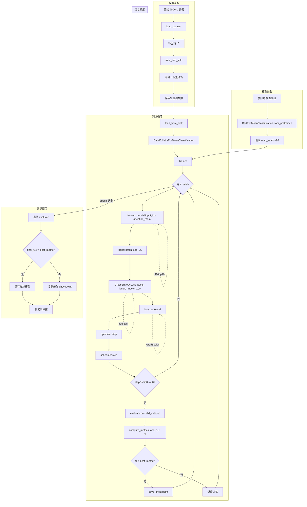

# 地址对齐项目教程文档

> **项目类型**: 序列标注（Token Classification）+ 地址校验  
> **使用框架**: PyTorch + Hugging Face Transformers  
> **模型架构**: BERT (RoBERTa-small)  
> **训练目标**: 交叉熵损失（Cross-Entropy）

---

## 第 1 章 项目介绍

### 1.1 项目概述

本项目旨在实现**地址对齐服务**，将用户输入的非结构化地址文本转换为符合业务数据库标准的结构化地址信息。

**核心功能**：

1. **序列标注**：使用 BERT 模型对地址文本逐字进行实体标注，识别省份、城市、区县、街道、详细地址、姓名、电话等信息
2. **地址提取**：根据标注结果提取各级地址实体
3. **地址校验**：通过数据库查询和编辑距离算法，对地址进行补全、纠错和验证

**典型使用场景**：

- 电商物流地址解析
- 快递地址规范化
- 用户注册地址信息提取

**端到端数据流**：

```
原始地址文本 → BERT 序列标注 → 实体提取 → 数据库校验 → 编辑距离匹配 → 结构化地址输出
```

### 1.2 项目背景推断（从代码分析）

| 项目属性       | 值                                                               |
| -------------- | ---------------------------------------------------------------- |
| **模型类型**   | BERT for Token Classification（序列标注）                        |
| **预训练模型** | `uer/roberta-small-wwm-chinese-cluecorpussmall`                  |
| **使用框架**   | PyTorch + Transformers + Trainer                                 |
| **输入形式**   | 地址字符串，如 `"浙江省杭州市余杭区葛墩路27号楼傅婷15830444519"` |
| **输出形式**   | 结构化字典：`{prov, city, district, town, detail, name, phone}`  |
| **训练目标**   | 交叉熵损失（内置于 BertForTokenClassification）                  |
| **标签体系**   | BIOES 标注（26 类标签）                                          |

---

## 第 2 章 需求分析

### 2.1 任务定义

| 维度         | 说明                                          |
| ------------ | --------------------------------------------- |
| **任务类型** | 序列标注（Token Classification） + 后处理校验 |
| **子任务**   | NER 命名实体识别（地址实体）                  |
| **后处理**   | 数据库查询 + 编辑距离匹配                     |

### 2.2 输入输出定义

**输入**：

| 字段   | 类型  | 示例                                              | 说明           |
| ------ | ----- | ------------------------------------------------- | -------------- |
| `text` | `str` | `"浙江省杭州市余杭区葛墩路27号楼傅婷15830444519"` | 原始地址字符串 |

**输出**：

| 字段       | 类型          | 示例            | 说明     |
| ---------- | ------------- | --------------- | -------- |
| `prov`     | `str \| None` | `"浙江省"`      | 省份     |
| `city`     | `str \| None` | `"杭州市"`      | 城市     |
| `district` | `str \| None` | `"余杭区"`      | 区/县    |
| `town`     | `str \| None` | `"葛墩路"`      | 街道/镇  |
| `detail`   | `str \| None` | `"27号楼"`      | 详细地址 |
| `name`     | `str \| None` | `"傅婷"`        | 姓名     |
| `phone`    | `str \| None` | `"15830444519"` | 电话     |

### 2.3 评价指标

| 指标          | 说明                         | 代码位置                                                                                                             |
| ------------- | ---------------------------- | -------------------------------------------------------------------------------------------------------------------- |
| **Accuracy**  | 整体准确率（忽略 -100 标签） | [token_classification.py:134](file:///c:/Users/Mayn/Desktop/address_alignment/token_classification.py#L134)          |
| **Precision** | 宏平均精确率                 | [token_classification.py:135-136](file:///c:/Users/Mayn/Desktop/address_alignment/token_classification.py#L135-L136) |
| **Recall**    | 宏平均召回率                 | 同上                                                                                                                 |
| **F1**        | 宏平均 F1 分数（主要指标）   | 同上                                                                                                                 |

### 2.4 约束与假设

| 约束             | 值                    | 来源                                                                                                                 |
| ---------------- | --------------------- | -------------------------------------------------------------------------------------------------------------------- |
| **最大序列长度** | 128                   | [token_classification.py:89](file:///c:/Users/Mayn/Desktop/address_alignment/token_classification.py#L89)            |
| **训练批次大小** | 64                    | [token_classification.py:105-106](file:///c:/Users/Mayn/Desktop/address_alignment/token_classification.py#L105-L106) |
| **学习率**       | 2e-5                  | [token_classification.py:107](file:///c:/Users/Mayn/Desktop/address_alignment/token_classification.py#L107)          |
| **训练轮次**     | 20                    | [token_classification.py:104](file:///c:/Users/Mayn/Desktop/address_alignment/token_classification.py#L104)          |
| **混合精度**     | bf16/fp16（自动选择） | [token_classification.py:111-112](file:///c:/Users/Mayn/Desktop/address_alignment/token_classification.py#L111-L112) |

---

## 第 3 章 开发环境准备

### 3.1 创建 conda 环境

```bash
# 创建环境（Python 3.10+ 推荐）
conda create -n address_align python=3.10 -y
conda activate address_align

# 安装 CUDA（如有 GPU）
conda install pytorch pytorch-cuda=11.8 -c pytorch -c nvidia
```

**版本选择依据**：

- Python 3.10+：支持 `list[str]` 类型注解语法
- CUDA 11.8：与 PyTorch 2.x 兼容性最佳

### 3.2 安装所需依赖

```bash
# 核心依赖（从代码 import 推断）
pip install torch transformers datasets scikit-learn numpy
pip install pymysql rapidfuzz
pip install fastapi uvicorn pydantic
```

**依赖说明**：

| 依赖                  | 作用                      |
| --------------------- | ------------------------- |
| `torch`               | PyTorch 深度学习框架      |
| `transformers`        | Hugging Face 预训练模型库 |
| `datasets`            | 数据集加载与处理          |
| `scikit-learn`        | 评估指标计算              |
| `pymysql`             | MySQL 数据库连接          |
| `rapidfuzz`           | 编辑距离计算              |
| `fastapi` / `uvicorn` | Web API 服务              |

### 3.3 项目目录结构

```
address_alignment/
├── config.py                 # 配置文件（路径、标签、数据库配置）
├── token_classification.py   # 训练与预测核心代码
├── address_alignment.py      # 地址对齐逻辑（提取+校验）
├── app.py                    # FastAPI Web 服务
├── sql_import.py             # 地址数据库导入脚本
├── data/
│   ├── raw/
│   │   └── data.jsonl        # 原始训练数据
│   ├── processed/            # 处理后的数据集
│   └── region.sql            # 地址数据表
├── pretrained/               # 预训练模型
├── finetuned/                # 微调后的模型
├── logs/                     # TensorBoard 日志
└── templates/
    └── index.html            # Web 前端页面
```

**入口脚本说明**：

| 脚本                      | 功能                                           |
| ------------------------- | ---------------------------------------------- |
| `token_classification.py` | **训练入口**：`python token_classification.py` |
| `address_alignment.py`    | **测试入口**：地址对齐功能测试                 |
| `app.py`                  | **服务入口**：`python app.py` 启动 API         |
| `sql_import.py`           | **数据导入**：导入地址数据表到 MySQL           |

---

## 第 4 章 数据预处理

### 4.1 数据集说明

#### 原始数据格式（JSONL）

```json
{
  "text": ["蒋", "博", "1", "3", "9", "5", "7", "9", "6", "3", "2", "8", "0", "浙", "江", "杭", "州", "市", ...],
  "labels": ["B-name", "E-name", "B-phone", "I-phone", ..., "B-prov", "E-prov", "B-city", "I-city", "E-city", ...]
}
```

#### 标签体系（BIOES）

| 前缀 | 含义               |
| ---- | ------------------ |
| `B-` | 实体开始（Begin）  |
| `I-` | 实体内部（Inside） |
| `E-` | 实体结束（End）    |
| `S-` | 单字实体（Single） |
| `O`  | 非实体（Outside）  |

**实体类型**：

| 实体 | 标签               | 说明             |
| ---- | ------------------ | ---------------- |
| 省份 | `B/I/E-prov`       | 省/自治区/直辖市 |
| 城市 | `B/I/E-city`       | 市/地区          |
| 区县 | `B/I/E/S-district` | 区/县            |
| 街镇 | `B/I/E/S-town`     | 街道/镇/乡       |
| 详细 | `B/I/E/S-detail`   | 详细地址         |
| 姓名 | `B/I/E-name`       | 收件人姓名       |
| 电话 | `B/I/E-phone`      | 联系电话         |

### 4.2 关键张量 Shape 表

| 张量名           | Shape                          | 类型                | 说明                            |
| ---------------- | ------------------------------ | ------------------- | ------------------------------- |
| `input_ids`      | `(batch, seq_len)`             | `torch.long`        | Token ID 序列                   |
| `attention_mask` | `(batch, seq_len)`             | `torch.long`        | 注意力掩码（1=有效，0=padding） |
| `labels`         | `(batch, seq_len)`             | `torch.long`        | 标签序列（-100=忽略）           |
| `logits`         | `(batch, seq_len, num_labels)` | `torch.float`       | 模型输出 logits                 |
| `loss`           | `()`                           | `torch.float`       | 标量损失值                      |
| `preds`          | `(batch, seq_len)`             | `np.ndarray`        | 预测标签 ID                     |
| `word_ids`       | `(seq_len,)`                   | `list[int \| None]` | 词到 token 的映射               |
| `tokenized`      | `dict`                         | `BatchEncoding`     | 分词结果字典                    |

**典型维度示例**（batch_size=64, max_len=128）：

```
input_ids:      (64, 128)
attention_mask: (64, 128)
labels:         (64, 128)
logits:         (64, 128, 26)
```

### 4.3 预处理过程

#### 关键代码：`preprocess` 函数

```python
# 位置: token_classification.py, 第 21-78 行

def preprocess(
    src_path: Path,
    tgt_path: Path,
    tokenizer: BertTokenizerFast,
    max_input_len: int,
    label_names: list[str],
    text_col="text",
    train_size=0.8,
    test_size=0.1,
):
    """处理分类任务数据集"""

    if os.path.exists(tgt_path):
        return  # 跳过已处理的数据

    # 1. 读取文件，将字符串标签转换为整数 ID
    label_feature = ClassLabel(names=label_names)
    datas = load_dataset("json", data_files=str(src_path))["train"].map(
        lambda x: {"labels": [label_feature.str2int(label) for label in x["labels"]]}
    )

    # 2. 随机打乱并切分为 train/valid/test
    datas = datas.train_test_split(test_size=test_size, shuffle=True)
    train_val = datas["train"].train_test_split(train_size=train_size / (1 - test_size))
    datas["train"], datas["valid"] = train_val["train"], train_val["test"]
```

#### 关键代码：标签对齐 `_map_fn`

```python
# 位置: token_classification.py, 第 45-64 行

def _map_fn(examples):
    # 分词（is_split_into_words=True 确保逐字处理）
    tokenized = tokenizer(
        examples[text_col],
        truncation=True,
        max_length=max_input_len,
        is_split_into_words=True,  # 关键！将字符列表作为一个序列处理
    )

    # 标签对齐：[CLS]/[SEP] 位置设为 -100（不计算 loss）
    labels = [
        [
            label_seq[j] if j is not None else -100  # j=None 表示特殊 token
            for j in tokenized.word_ids(batch_index=i)  # word_ids 返回词索引
        ]
        for i, label_seq in enumerate(examples["labels"])
    ]
    tokenized["labels"] = labels
    return tokenized
```

**关键点解释**：

1. **`is_split_into_words=True`**：让 tokenizer 将字符列表视为一个序列，确保逐字分词
2. **`word_ids()`**：返回每个 token 对应的原始词索引
   - `None` 表示 `[CLS]` / `[SEP]` 等特殊 token
   - 用于将标签与 token 对齐
3. **`-100`**：PyTorch 交叉熵损失的 `ignore_index`，不参与 loss 计算

### 4.4 构建 Dataset 和 DataLoader

#### DataCollator 动态填充

```python
# 位置: token_classification.py, 第 154 行

data_collator = DataCollatorForTokenClassification(tokenizer)
```

**工作原理**：

- 不在预处理阶段进行 padding，而是在每个 batch 内动态填充到该 batch 的最大长度
- 节省显存（相比全局固定长度）
- 自动处理 `input_ids`、`attention_mask`、`labels`

#### Trainer 内置 DataLoader

Trainer 会自动创建 DataLoader，关键参数由 `TrainingArguments` 控制：

```python
# 位置: token_classification.py, 第 105-106 行

per_device_train_batch_size=64,  # 每个 GPU 的批次大小
per_device_eval_batch_size=64,   # 验证批次大小
```

---

## 第 5 章 模型定义

### 5.1 模型结构概览

```
┌─────────────────────────────────────────────────────────────┐
│                  BertForTokenClassification                 │
├─────────────────────────────────────────────────────────────┤
│  ┌─────────────────────────────────────────────────────┐   │
│  │    Input: input_ids (batch, seq_len)                │   │
│  └─────────────────────────────────────────────────────┘   │
│                          ↓                                  │
│  ┌─────────────────────────────────────────────────────┐   │
│  │    Embedding Layer                                   │   │
│  │    - Token Embedding                                 │   │
│  │    - Position Embedding                              │   │
│  │    - Segment Embedding                               │   │
│  │    Output: (batch, seq_len, hidden_size=256)        │   │
│  └─────────────────────────────────────────────────────┘   │
│                          ↓                                  │
│  ┌─────────────────────────────────────────────────────┐   │
│  │    BERT Encoder (3 Transformer Layers)              │   │
│  │    - Multi-Head Self-Attention                      │   │
│  │    - Feed-Forward Network                           │   │
│  │    Output: (batch, seq_len, hidden_size=256)        │   │
│  └─────────────────────────────────────────────────────┘   │
│                          ↓                                  │
│  ┌─────────────────────────────────────────────────────┐   │
│  │    Dropout (0.1)                                     │   │
│  └─────────────────────────────────────────────────────┘   │
│                          ↓                                  │
│  ┌─────────────────────────────────────────────────────┐   │
│  │    Classification Head (Linear)                     │   │
│  │    Linear(hidden_size, num_labels=26)               │   │
│  │    Output: (batch, seq_len, 26)                     │   │
│  └─────────────────────────────────────────────────────┘   │
└─────────────────────────────────────────────────────────────┘
```

### 5.2 模型加载代码

```python
# 位置: token_classification.py, 第 97-99 行

# 加载预训练模型，并设置分类头的类别数
model = BertForTokenClassification.from_pretrained(
    model_path,
    num_labels=len(config.LABELS)  # 26 类标签
)
```

**参数说明**：

- `model_path`：预训练模型路径（`uer/roberta-small-wwm-chinese-cluecorpussmall`）
- `num_labels`：分类类别数（26）

**RoBERTa-small 架构**（从代码推断）：

| 参数             | 值   |
| ---------------- | ---- |
| 隐藏层维度       | 256  |
| 注意力头数       | 4    |
| Transformer 层数 | 3    |
| 参数量           | ~15M |

---

## 第 6 章 模型训练

### 6.1 功能说明

训练流程由 HuggingFace **Trainer** 封装，核心循环：

```
for epoch in range(num_epochs):
    for batch in train_dataloader:
        logits = model(batch)           # 前向传播
        loss = cross_entropy(logits, labels)  # 计算损失
        loss.backward()                 # 反向传播
        optimizer.step()                # 参数更新
        scheduler.step()                # 学习率调度

        if step % eval_steps == 0:
            evaluate()                  # 验证
            save_checkpoint()           # 保存
```

### 6.2 训练参数配置

```python
# 位置: token_classification.py, 第 102-125 行

training_args = TrainingArguments(
    output_dir=config.FINETUNED_PATH,       # 模型保存路径
    num_train_epochs=20,                     # 训练轮次
    per_device_train_batch_size=64,          # 批次大小
    per_device_eval_batch_size=64,
    learning_rate=2e-5,                      # 初始学习率
    warmup_ratio=0.2,                        # 预热比例（前20%步数）
    lr_scheduler_type="cosine",              # 余弦退火调度
    weight_decay=0.01,                       # 权重衰减（L2正则）
    bf16=is_bf16_supported(),                # 自动选择 bf16
    fp16=not is_bf16_supported(),            # 否则用 fp16
    eval_strategy="steps",                   # 按步数验证
    save_strategy="steps",                   # 按步数保存
    eval_steps=500,                          # 每500步验证
    save_steps=500,                          # 每500步保存
    logging_steps=200,                       # 每200步记录日志
    logging_dir=config.LOGS_PATH,
    save_total_limit=3,                      # 最多保留3个checkpoint
    save_only_model=True,                    # 只保存模型权重
    metric_for_best_model="eval_f1",         # 按 F1 选最优
    greater_is_better=True,
    logging_first_step=True,
)
```

### 6.3 评估指标计算

```python
# 位置: token_classification.py, 第 128-145 行

def compute_metrics(eval_pred: EvalPrediction):
    logits, labels = eval_pred

    # 1. 取 argmax 得到预测标签
    preds = np.argmax(logits, axis=-1)

    # 2. 过滤掉 -100（特殊token位置）
    mask = labels != -100
    y_true = labels[mask]
    y_pred = preds[mask]

    # 3. 计算准确率
    acc = (y_true == y_pred).mean()

    # 4. 计算 precision/recall/f1（宏平均）
    p, r, f1, _ = precision_recall_fscore_support(
        y_true, y_pred, average="macro", zero_division=0
    )

    return {
        "accuracy": float(acc),
        "precision": float(p),
        "recall": float(r),
        "f1": float(f1),
    }
```

### 6.4 Trainer 构建与训练

```python
# 位置: token_classification.py, 第 148-159 行

trainer = Trainer(
    model=model,
    args=training_args,
    train_dataset=train_dataset,
    eval_dataset=valid_dataset,
    processing_class=tokenizer,              # 用于保存 tokenizer
    data_collator=DataCollatorForTokenClassification(tokenizer),
    compute_metrics=compute_metrics,
)

# 开始训练
trainer.train()
```

### 6.5 最优模型保存

```python
# 位置: token_classification.py, 第 161-178 行

# 最终验证
final_eval_metrics = trainer.evaluate()

# 获取训练过程中的最佳 F1
best_metric = getattr(trainer.state, "best_metric", 0.0)
best_dir = config.FINETUNED_PATH / "best"

# 如果最终模型更好，直接保存
if final_eval_metrics.get("eval_f1", 0.0) >= best_metric:
    trainer.save_model(best_dir)
    tokenizer.save_pretrained(best_dir)
# 否则复制最佳 checkpoint
else:
    best_checkpoint = trainer.state.best_model_checkpoint
    if best_checkpoint:
        shutil.copytree(best_checkpoint, best_dir, dirs_exist_ok=True)
        tokenizer.save_pretrained(best_dir)
```

### 6.6 执行训练

```bash
# 运行训练
python token_classification.py
```

**训练不收敛/NaN/显存爆排查顺序**：

1. **检查 learning_rate**：过大会导致 NaN（建议 1e-5 ~ 5e-5）
2. **检查 batch_size**：过大会 OOM（减半尝试）
3. **检查数据标签**：-100 以外的值是否在 [0, num_labels) 范围内
4. **检查 fp16/bf16**：部分 GPU 不支持 bf16
5. **梯度裁剪**：Trainer 默认 `max_grad_norm=1.0`

---

## 第 7 章 模型预测

### 7.1 功能说明

**predict 函数**：

- 输入：单个字符串或字符串列表
- 输出：每个字符对应的标签列表

```
输入: "浙江省杭州市"
输出: ["B-prov", "I-prov", "E-prov", "B-city", "I-city", "E-city"]
```

### 7.2 预测代码实现

```python
# 位置: token_classification.py, 第 185-232 行

@torch.inference_mode()  # 等价于 with torch.no_grad()，更高效
def predict(
    text: str | list[str],
    model: BertForTokenClassification,
    tokenizer: BertTokenizerFast,
    label_names: list[str],
    batch_size=64,
):
    model.eval()  # 切换到评估模式
    device = next(model.parameters()).device  # 获取模型设备

    # 统一转换为列表
    texts = text if isinstance(text, list) else [text]

    res: list[list[str]] = []
    for i in range(0, len(texts), batch_size):  # 分批处理
        batch = texts[i : i + batch_size]

        # 将字符串拆成字符列表（去除空格）
        batch_words = [list(t.replace(" ", "")) for t in batch]

        # 分词
        tokenized = tokenizer(
            batch_words,
            max_length=128,
            truncation=True,
            padding=True,
            return_tensors="pt",
            is_split_into_words=True,
        ).to(device)

        # 前向传播
        outputs = model(tokenized["input_ids"], tokenized["attention_mask"])
        preds = torch.argmax(outputs["logits"], dim=-1).detach().cpu()

        # 过滤 [CLS] 和 [SEP] 的预测
        filtered_preds = [
            [
                label_names[label_seq[j + 1].item()]  # j+1 跳过 [CLS]
                for j in tokenized.word_ids(batch_index=i)
                if j is not None  # 过滤 [CLS]/[SEP]
            ]
            for i, label_seq in enumerate(preds)
        ]

        # 将原始空格位置标注为 'O'
        filled_preds = []
        for string, labels in zip(batch, filtered_preds):
            labels_iter = iter(labels)
            filled_preds.append(
                [next(labels_iter) if char != " " else "O" for char in string]
            )
        res.extend(filled_preds)

    return res if isinstance(text, list) else res[0]
```

### 7.3 执行预测

```python
# 位置: token_classification.py, 第 236-257 行 (主函数)

# 加载模型
model_path = config.FINETUNED_PATH / "best"
model = BertForTokenClassification.from_pretrained(model_path).to(config.DEVICE)
tokenizer = BertTokenizerFast.from_pretrained(model_path)

# 预测
texts = ["浙江省杭州市余杭区葛墩路27号楼傅婷15830444519"]
res = predict(texts, model, tokenizer, config.LABELS)

# 输出
for ts, rs in zip(texts, res):
    for t, r in zip(ts, rs):
        print(t, r)
```

---

## 第 8 章 模型评估

### 8.1 功能说明

评估在测试集上进行，指标包括：

- **Accuracy**：整体准确率
- **Precision/Recall/F1**：宏平均（macro）

### 8.2 评估代码

```python
# 位置: token_classification.py, 第 181-182 行

# 在测试集上评估
test_metrics = trainer.evaluate(
    eval_dataset=test_dataset,
    metric_key_prefix="test"
)
print(test_metrics)
```

### 8.3 执行评估

评估在训练脚本末尾自动执行，输出示例：

```
{
    'test_accuracy': 0.95,
    'test_precision': 0.92,
    'test_recall': 0.91,
    'test_f1': 0.915,
    'test_loss': 0.12
}
```

---

## 第 9 章 训练优化

### 9.1 早停（Early Stopping）

**代码中未显式使用早停**，但可通过以下方式添加：

```python
from transformers import EarlyStoppingCallback

trainer = Trainer(
    ...,
    callbacks=[
        EarlyStoppingCallback(
            early_stopping_patience=3,  # 3次不改善则停止
            early_stopping_threshold=0.01  # 改善阈值
        )
    ]
)
```

**注意**：需要设置 `load_best_model_at_end=True`

### 9.2 混合精度训练

**已在代码中启用**：

```python
# 位置: token_classification.py, 第 111-112 行

bf16=is_bf16_supported(),  # 优先使用 bf16（Ampere+）
fp16=not is_bf16_supported(),  # 否则用 fp16
```

**风险与注意事项**：

- bf16 比 fp16 数值范围更大，更稳定
- 某些操作（如 softmax）在低精度下可能溢出
- Trainer 自动处理 loss scaling

### 9.3 检查点机制

**保存内容**（`save_only_model=True` 时只保存模型权重）：

```python
# 位置: token_classification.py, 第 119-120 行

save_total_limit=3,      # 最多保留3个checkpoint
save_only_model=True,    # 只保存模型权重
```

**恢复训练示例**：

```python
# 从 checkpoint 恢复
trainer.train(resume_from_checkpoint="finetuned/checkpoint-1000")
```

---

## 第 10 章 模型应用与部署

### 10.1 功能说明

**部署形态**：FastAPI REST API

**输入输出契约**：

```python
# 请求体
class AddressAlignmentRequest(BaseModel):
    message: str  # 地址文本

# 响应体
class AddressAlignmentResponse(BaseModel):
    prov: str | None
    city: str | None
    district: str | None
    town: str | None
    detail: str | None
    name: str | None
    phone: str | None
```

### 10.2 服务代码

```python
# 位置: app.py, 第 24-54 行

app = FastAPI()

# 启动时加载模型
model_path = config.FINETUNED_PATH / "best"
model = BertForTokenClassification.from_pretrained(model_path).to(config.DEVICE)
tokenizer = BertTokenizerFast.from_pretrained(model_path)

@app.post("/address_alignment")
async def handle_message(request: AddressAlignmentRequest) -> AddressAlignmentResponse:
    user_message = request.message
    address = address_alignment(
        user_message, model, tokenizer, config.LABELS, config.MYSQL_CONFIG
    )
    return AddressAlignmentResponse(**address)
```

### 10.3 启动服务

```bash
python app.py
```

服务将在 `http://0.0.0.0:8089` 启动

### 10.4 接口测试

**Python 请求**：

```python
import requests

response = requests.post(
    "http://localhost:8089/address_alignment",
    json={"message": "浙江省杭州市余杭区葛墩路27号楼傅婷15830444519"}
)
print(response.json())
```

**示例响应**：

```json
{
  "prov": "浙江省",
  "city": "杭州市",
  "district": "余杭区",
  "town": null,
  "detail": "葛墩路27号楼",
  "name": "傅婷",
  "phone": "15830444519"
}
```

**curl 请求**：

```bash
curl -X POST http://localhost:8089/address_alignment \
  -H "Content-Type: application/json" \
  -d '{"message": "浙江省杭州市余杭区葛墩路27号楼傅婷15830444519"}'
```

---

## 第 11 章 编写入口脚本

### 11.1 脚本职责

| 脚本                      | 职责                                         |
| ------------------------- | -------------------------------------------- |
| `token_classification.py` | 训练（`if __name__ == "__main__"` 直接运行） |
| `address_alignment.py`    | 地址对齐测试                                 |
| `app.py`                  | API 服务                                     |
| `sql_import.py`           | 数据库导入                                   |

### 11.2 建议的入口组织（改进方案）

```python
# main.py - 统一入口（建议新增）

import argparse
import config

def main():
    parser = argparse.ArgumentParser(description="地址对齐系统")
    subparsers = parser.add_subparsers(dest="command")

    # 训练子命令
    train_parser = subparsers.add_parser("train", help="训练模型")
    train_parser.add_argument("--epochs", type=int, default=20)
    train_parser.add_argument("--batch-size", type=int, default=64)
    train_parser.add_argument("--lr", type=float, default=2e-5)

    # 预测子命令
    predict_parser = subparsers.add_parser("predict", help="预测地址")
    predict_parser.add_argument("--text", type=str, required=True)

    # 服务子命令
    serve_parser = subparsers.add_parser("serve", help="启动 API 服务")
    serve_parser.add_argument("--port", type=int, default=8089)

    args = parser.parse_args()

    if args.command == "train":
        from token_classification import train
        train(config.ROBERTA_SMALL)
    elif args.command == "predict":
        # ...
    elif args.command == "serve":
        import uvicorn
        uvicorn.run("app:app", host="0.0.0.0", port=args.port)

if __name__ == "__main__":
    main()
```

**使用示例**：

```bash
python main.py train --epochs 10
python main.py predict --text "浙江省杭州市..."
python main.py serve --port 8080
```

---

# 附录

## A. 关键代码清单

### A.1 数据预处理 - 标签对齐

```python
# 文件: token_classification.py, 行 45-64
# 改动影响: 训练数据格式、模型输入、loss 计算

def _map_fn(examples):
    # 分词，is_split_into_words=True 确保逐字处理
    tokenized = tokenizer(
        examples[text_col],
        truncation=True,
        max_length=max_input_len,
        is_split_into_words=True,
    )
    # 标签对齐：特殊 token 位置设为 -100
    labels = [
        [
            label_seq[j] if j is not None else -100
            for j in tokenized.word_ids(batch_index=i)
        ]
        for i, label_seq in enumerate(examples["labels"])
    ]
    tokenized["labels"] = labels
    return tokenized
```

### A.2 模型加载

```python
# 文件: token_classification.py, 行 97-99
# 改动影响: 模型架构、参数量

model = BertForTokenClassification.from_pretrained(
    model_path,
    num_labels=len(config.LABELS)  # 修改此值添加/移除标签类别
)
```

### A.3 评估指标计算

```python
# 文件: token_classification.py, 行 128-145
# 改动影响: 模型选择标准、日志记录

def compute_metrics(eval_pred: EvalPrediction):
    logits, labels = eval_pred
    preds = np.argmax(logits, axis=-1)
    mask = labels != -100
    y_true = labels[mask]
    y_pred = preds[mask]
    acc = (y_true == y_pred).mean()
    p, r, f1, _ = precision_recall_fscore_support(
        y_true, y_pred, average="macro", zero_division=0
    )
    return {"accuracy": float(acc), "precision": float(p),
            "recall": float(r), "f1": float(f1)}
```

### A.4 预测函数核心逻辑

```python
# 文件: token_classification.py, 行 213-214
# 改动影响: 推理结果

outputs = model(tokenized["input_ids"], tokenized["attention_mask"])
preds = torch.argmax(outputs["logits"], dim=-1).detach().cpu()
```

### A.5 地址提取

```python
# 文件: address_alignment.py, 行 25-47
# 改动影响: 实体边界识别

def address_extract(text: str, tagging: list[str]) -> dict[str, Optional[str]]:
    tagging = [i[2:] for i in tagging]  # 去除 B-/I-/E- 前缀
    address = {"prov": None, "city": None, "district": None,
               "town": None, "detail": None, "name": None, "phone": None}
    start_pos = 0
    tag_len = len(tagging)
    for end_pos in range(tag_len):
        if (end_pos == tag_len - 1) or (tagging[end_pos + 1] != tagging[start_pos]):
            if tagging[start_pos] != "":
                address[tagging[start_pos]] = text[start_pos : end_pos + 1]
            start_pos = end_pos + 1
    return address
```

### A.6 地址校验 - 数据库查询

```python
# 文件: address_alignment.py, 行 89-114
# 改动影响: 地址补全、纠错质量

with pymysql.connect(**mysql_config) as mysql_conn:
    with mysql_conn.cursor(pymysql.cursors.DictCursor) as cursor:
        # 构造查询参数
        params_list = [
            (i, address[k]) for i, k in zip(region_type_ids, region_type_names)
        ]
        # 处理标签错位（省/市/区可能被错误标注）
        params_list.extend([
            (2, address["city"]),
            (3, address["prov"]),
            (3, address["district"]),
        ])
        # 执行查询
        cursor.execute(sql, params)
        rows = cursor.fetchall()
```

### A.7 编辑距离匹配

```python
# 文件: address_alignment.py, 行 148-153
# 改动影响: 最终地址选择

scores = [fuzz.ratio(i, text) for i in address_texts]
correct_address_chain = address_chains[scores.index(max(scores))]
```

### A.8 FastAPI 路由

```python
# 文件: app.py, 行 37-54
# 改动影响: API 接口

@app.post("/address_alignment")
async def handle_message(request: AddressAlignmentRequest) -> AddressAlignmentResponse:
    address = address_alignment(
        request.message, model, tokenizer, config.LABELS, config.MYSQL_CONFIG
    )
    return AddressAlignmentResponse(**address)
```

### A.9 训练参数配置

```python
# 文件: token_classification.py, 行 102-125
# 改动影响: 训练效果、速度、显存占用

training_args = TrainingArguments(
    output_dir=config.FINETUNED_PATH,
    num_train_epochs=20,
    per_device_train_batch_size=64,
    learning_rate=2e-5,
    warmup_ratio=0.2,
    lr_scheduler_type="cosine",
    weight_decay=0.01,
    bf16=is_bf16_supported(),
    # ... 更多参数
)
```

### A.10 模型保存逻辑

```python
# 文件: token_classification.py, 行 167-178
# 改动影响: 保存的模型版本

if final_eval_metrics.get("eval_f1", 0.0) >= best_metric:
    trainer.save_model(best_dir)
    tokenizer.save_pretrained(best_dir)
else:
    best_checkpoint = trainer.state.best_model_checkpoint
    if best_checkpoint:
        shutil.copytree(best_checkpoint, best_dir, dirs_exist_ok=True)
        tokenizer.save_pretrained(best_dir)
```

---

## B. 可改造示例合集

### B.1 结构改造

#### 改造 1：添加 CRF 层

```python
# 安装: pip install pytorch-crf

from torchcrf import CRF

class BertCRF(BertPreTrainedModel):
    def __init__(self, config):
        super().__init__(config)
        self.bert = BertModel(config)
        self.dropout = nn.Dropout(config.hidden_dropout_prob)
        self.classifier = nn.Linear(config.hidden_size, config.num_labels)
        self.crf = CRF(config.num_labels, batch_first=True)

    def forward(self, input_ids, attention_mask, labels=None):
        outputs = self.bert(input_ids, attention_mask=attention_mask)
        sequence_output = self.dropout(outputs[0])
        emissions = self.classifier(sequence_output)

        if labels is not None:
            # 训练：返回负对数似然 loss
            mask = attention_mask.bool()
            loss = -self.crf(emissions, labels, mask=mask, reduction='mean')
            return {"loss": loss, "logits": emissions}
        else:
            # 预测：使用 Viterbi 解码
            return {"logits": self.crf.decode(emissions)}
```

#### 改造 2：添加 BiLSTM 层

```python
class BertBiLSTM(BertPreTrainedModel):
    def __init__(self, config):
        super().__init__(config)
        self.bert = BertModel(config)
        self.lstm = nn.LSTM(
            config.hidden_size,
            config.hidden_size // 2,
            batch_first=True,
            bidirectional=True
        )
        self.classifier = nn.Linear(config.hidden_size, config.num_labels)

    def forward(self, input_ids, attention_mask, labels=None):
        outputs = self.bert(input_ids, attention_mask=attention_mask)
        lstm_out, _ = self.lstm(outputs[0])
        logits = self.classifier(lstm_out)

        loss = None
        if labels is not None:
            loss_fct = nn.CrossEntropyLoss()
            loss = loss_fct(logits.view(-1, self.config.num_labels), labels.view(-1))

        return {"loss": loss, "logits": logits}
```

#### 改造 3：添加 LayerNorm 和更深的分类头

```python
class BertDeepHead(BertPreTrainedModel):
    def __init__(self, config):
        super().__init__(config)
        self.bert = BertModel(config)
        self.classifier = nn.Sequential(
            nn.Linear(config.hidden_size, config.hidden_size),
            nn.LayerNorm(config.hidden_size),
            nn.GELU(),
            nn.Dropout(0.1),
            nn.Linear(config.hidden_size, config.num_labels)
        )
```

### B.2 损失函数改造

#### 改造 1：Focal Loss（处理类别不平衡）

```python
class FocalLoss(nn.Module):
    def __init__(self, alpha=1, gamma=2, ignore_index=-100):
        super().__init__()
        self.alpha = alpha
        self.gamma = gamma
        self.ignore_index = ignore_index

    def forward(self, logits, labels):
        # logits: (batch, seq, num_classes)
        # labels: (batch, seq)
        ce_loss = F.cross_entropy(
            logits.view(-1, logits.size(-1)),
            labels.view(-1),
            ignore_index=self.ignore_index,
            reduction='none'
        )
        pt = torch.exp(-ce_loss)
        focal_loss = self.alpha * (1 - pt) ** self.gamma * ce_loss
        return focal_loss.mean()

# 使用方式（需要自定义 Trainer）
class CustomTrainer(Trainer):
    def compute_loss(self, model, inputs, return_outputs=False, **kwargs):
        labels = inputs.pop("labels")
        outputs = model(**inputs)
        logits = outputs["logits"]
        loss = FocalLoss()(logits, labels)
        return (loss, outputs) if return_outputs else loss
```

#### 改造 2：Label Smoothing

```python
class LabelSmoothingLoss(nn.Module):
    def __init__(self, smoothing=0.1, ignore_index=-100):
        super().__init__()
        self.smoothing = smoothing
        self.ignore_index = ignore_index

    def forward(self, logits, labels):
        num_classes = logits.size(-1)
        smooth_labels = torch.zeros_like(logits).scatter_(
            -1, labels.unsqueeze(-1), 1.0
        )
        smooth_labels = smooth_labels * (1 - self.smoothing) + self.smoothing / num_classes

        log_probs = F.log_softmax(logits, dim=-1)
        loss = -(smooth_labels * log_probs).sum(dim=-1)

        mask = labels != self.ignore_index
        return loss[mask].mean()
```

### B.3 优化器/调参改造

#### 改造 1：使用 AdamW 分层学习率

```python
from transformers import get_linear_schedule_with_warmup

# 分层学习率：BERT 层用较小学习率，分类头用较大学习率
optimizer_grouped_parameters = [
    {
        "params": [p for n, p in model.named_parameters() if "bert" in n],
        "lr": 1e-5,
    },
    {
        "params": [p for n, p in model.named_parameters() if "classifier" in n],
        "lr": 5e-5,
    },
]
optimizer = torch.optim.AdamW(optimizer_grouped_parameters)
```

#### 改造 2：使用 Warmup + Cosine Annealing

```python
from transformers import get_cosine_schedule_with_warmup

total_steps = len(train_dataloader) * num_epochs
warmup_steps = int(0.1 * total_steps)

scheduler = get_cosine_schedule_with_warmup(
    optimizer,
    num_warmup_steps=warmup_steps,
    num_training_steps=total_steps
)
```

#### 改造 3：添加梯度累积

```python
training_args = TrainingArguments(
    ...,
    gradient_accumulation_steps=4,  # 每4步更新一次
    # 等效 batch_size = per_device_batch_size * gradient_accumulation_steps
)
```

#### 改造 4：添加梯度裁剪

```python
training_args = TrainingArguments(
    ...,
    max_grad_norm=1.0,  # 默认值
)
```

---

## C. Mermaid 训练流程图



---

## D. 潜在问题清单 + 修复建议

### D.1 数据相关问题

| 问题                             | 风险等级 | 修复建议                            |
| -------------------------------- | -------- | ----------------------------------- |
| **标签类别不在 [0, num_labels)** | 🔴 高    | 在 `compute_metrics` 中添加断言检查 |
| **空字符串输入**                 | 🟡 中    | 在 predict 函数开头添加长度检查     |
| **中英文混合分词**               | 🟡 中    | 确保使用 `is_split_into_words=True` |

### D.2 模型相关问题

| 问题                    | 风险等级 | 修复建议                                        |
| ----------------------- | -------- | ----------------------------------------------- |
| **设备不一致**          | 🔴 高    | 使用 `next(model.parameters()).device` 确保一致 |
| **eval 模式遗漏**       | 🔴 高    | 确保 predict 前调用 `model.eval()`              |
| **inference_mode 遗漏** | 🟡 中    | 使用 `@torch.inference_mode()` 装饰器           |

### D.3 数值稳定性问题

| 问题                   | 风险等级 | 修复建议                            |
| ---------------------- | -------- | ----------------------------------- |
| **学习率过大导致 NaN** | 🔴 高    | 使用 2e-5 ~ 5e-5 的范围             |
| **bf16 不支持**        | 🟡 中    | 使用 `is_bf16_supported()` 自动检测 |
| **梯度爆炸**           | 🟡 中    | 设置 `max_grad_norm=1.0`            |

### D.4 地址校验问题

| 问题               | 风险等级 | 修复建议                   |
| ------------------ | -------- | -------------------------- |
| **MySQL 连接失败** | 🔴 高    | 添加 try-except 和连接重试 |
| **空地址查询**     | 🟡 中    | 检查 `params_list` 非空    |
| **编辑距离误匹配** | 🟢 低    | 设置相似度阈值（如 > 60%） |

### D.5 部署问题

| 问题                    | 风险等级 | 修复建议                          |
| ----------------------- | -------- | --------------------------------- |
| **`sleep(1)` 影响性能** | 🟡 中    | 移除 `app.py` 第 43-45 行的 sleep |
| **模型未预加载**        | 🟢 低    | 当前代码已在启动时加载模型        |
| **并发请求**            | 🟡 中    | 考虑使用模型线程池或队列          |

---

> **文档版本**: 1.0  
> **生成日期**: 2025-12-30  
> **项目路径**: `c:\Users\Mayn\Desktop\address_alignment`
