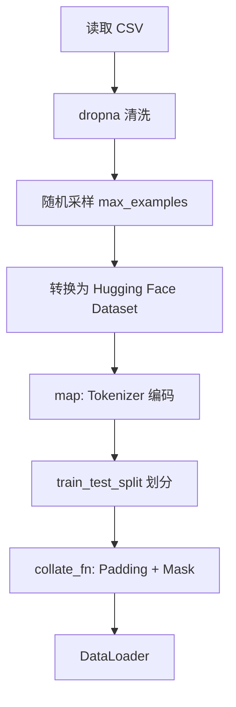
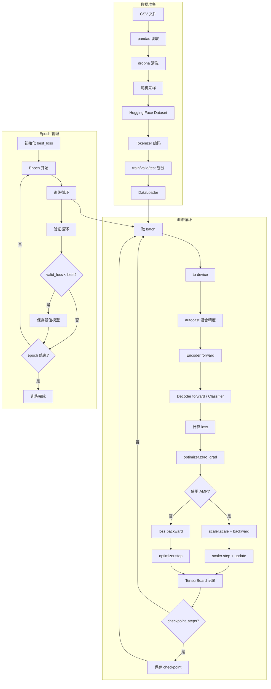

# 智选新闻：大模型微调项目完全指南

> **项目概述**：基于 BART 预训练模型，微调实现**新闻分类**（7 类）和**新闻摘要**（Seq2Seq 生成），并通过 FastAPI 发布 Web 服务。
>
> **技术栈**：PyTorch + Transformers + FastAPI + TensorBoard

---

## 第 1 章 项目介绍

### 1.1 项目做什么

本项目旨在微调预训练语言模型，完成两个核心 NLP 任务：

1. **新闻分类**：将输入的新闻文本分为 7 个类别（财经、社会、教育、科技、时政、体育、游戏）
2. **新闻摘要**：自动生成新闻文本的摘要（Seq2Seq 文本生成任务）

**典型使用场景**：

- 新闻推荐系统：根据分类结果推荐用户感兴趣的新闻
- 新闻聚合网站：按类别整理新闻内容
- 媒体编辑：批量处理新闻稿件
- 搜索引擎优化：对新闻内容进行预分类以加速检索

### 1.2 端到端数据流（一句话总结）

```
CSV原始数据 → pandas读取/采样 → Tokenizer编码+Padding → DataLoader批处理
→ BART Encoder/Decoder前向传播 → CrossEntropyLoss → AdamW优化
→ 保存最佳模型 → FastAPI服务接口 → 返回分类+摘要结果
```

---

## 第 2 章 需求分析

### 2.1 任务定义

| 任务     | 类型               | 描述                   |
| -------- | ------------------ | ---------------------- |
| 新闻分类 | 多类别分类（7 类） | 将新闻文本分到指定类别 |
| 新闻摘要 | Seq2Seq 生成任务   | 输入长文本，生成短摘要 |

### 2.2 输入输出定义

**分类任务**：

- **输入**：新闻文本字符串（最大长度 1024 tokens）
- **输出**：类别名称（字符串），如"科技"、"体育"

**摘要任务**：

- **输入**：新闻文本字符串（最大长度 1024 tokens）
- **输出**：摘要文本（最大长度 128 tokens）

### 2.3 评价指标

| 任务 | 指标                           | 业务含义                   |
| ---- | ------------------------------ | -------------------------- |
| 分类 | Accuracy                       | 整体分类准确率             |
| 分类 | Precision/Recall/F1 (weighted) | 加权平均的精确率/召回率/F1 |
| 分类 | AUC                            | 多分类 ROC-AUC（OVR 方式） |
| 摘要 | ROUGE-1                        | unigram 重合率             |
| 摘要 | ROUGE-2                        | bigram 重合率              |
| 摘要 | ROUGE-L                        | 最长公共子序列             |

### 2.4 约束与假设

| 项目         | 值/描述                                     |
| ------------ | ------------------------------------------- |
| 数据规模     | news.csv（约 285MB，约数十万条）            |
| max_examples | 100,000（代码默认）                         |
| batch_size   | 8                                           |
| epochs       | 2                                           |
| 学习率       | 5e-5                                        |
| 设备         | CUDA（若可用）或 CPU                        |
| 推理延迟     | **代码中未体现**【推断】GPU 单条约 50-200ms |

---

## 第 3 章 开发环境准备

### 3.1 创建 Conda 环境

```bash
# 创建虚拟环境（项目推荐 Python 3.12）
conda create -n news-classify-summarize python=3.12

# 激活环境
conda activate news-classify-summarize

# 配置国内源（可选）
pip config set global.index-url https://pypi.tuna.tsinghua.edu.cn/simple
```

> [!NOTE]
> 选择 Python 3.12 是因为项目需要 `match-case` 语法（Python 3.10+），且 3.12 对性能有优化。

### 3.2 安装所需依赖

```bash
# 根据 CUDA 版本安装 PyTorch（这里以 CUDA 12.6 为例）
pip3 install torch torchvision torchaudio --index-url https://download.pytorch.org/whl/cu126

# 安装其他依赖
pip install pandas matplotlib scikit-learn tqdm transformers datasets \
    tensorboard evaluate rouge-score nltk fastapi uvicorn
```

**关键依赖说明**：

| 依赖                       | 作用                        |
| -------------------------- | --------------------------- |
| `torch`                    | 深度学习框架核心            |
| `transformers`             | 加载预训练模型（BART）      |
| `datasets`                 | Hugging Face 数据集处理工具 |
| `tensorboard`              | 训练过程可视化              |
| `evaluate` + `rouge-score` | 摘要评估指标计算            |
| `fastapi` + `uvicorn`      | Web 服务框架                |

### 3.3 项目目录结构

```
ai-news/
├── data/                   # 原始数据集
│   └── news.csv            # 新闻数据（包含 text, category, summary 列）
├── pretrained/             # 预训练模型
│   ├── bart-base-chinese/  # BART 中文预训练模型
│   └── bert-base-chinese/  # (备用的 BERT 模型)
├── rouge/                  # ROUGE 评估指标（本地副本）
│   ├── rouge.json
│   └── rouge.py
├── templates/              # Web 前端模板
│   └── index.html
├── finetuned/              # 微调后的模型参数存储路径
├── logs/                   # TensorBoard 日志目录
├── common.py               # 公共配置模块
├── preprocess.py           # 数据预处理模块
├── models_def.py           # 模型定义（分类 + 摘要）
├── train.py                # 训练器定义
├── main.py                 # 主程序入口
└── app.py                  # FastAPI Web 服务
```

---

## 第 4 章 数据预处理

### 4.1 数据集说明

**数据字段表**：

| 字段       | 类型   | 含义     | 示例                                |
| ---------- | ------ | -------- | ----------------------------------- |
| `text`     | string | 新闻正文 | "4 月 13 日，全球首个人形机器人..." |
| `category` | string | 新闻类别 | "科技"                              |
| `summary`  | string | 新闻摘要 | "机器人马拉松在京举行"              |

**分类类别列表**（共 7 类）：

```python
CATEGORY_LIST = ["财经", "社会", "教育", "科技", "时政", "体育", "游戏"]
```

### 4.2 关键张量 shape 表

| 张量名称               | Shape                                  | 说明                               |
| ---------------------- | -------------------------------------- | ---------------------------------- |
| `input_ids`            | `[batch_size, seq_len]`                | 编码后的 token ID，典型 `[8, 512]` |
| `attention_mask`       | `[batch_size, seq_len]`                | 注意力掩码，1=有效，0=padding      |
| `labels` (分类)        | `[batch_size]`                         | 类别索引，范围 `[0, 6]`            |
| `labels` (摘要)        | `[batch_size, target_len]`             | 目标序列 ID，padding 位置为 `-100` |
| `encoder_hidden_state` | `[batch_size, seq_len, 768]`           | BART 编码器输出                    |
| `decoder_hidden_state` | `[batch_size, target_len, 768]`        | BART 解码器输出                    |
| `logits` (分类)        | `[batch_size, 7]`                      | 分类 logits                        |
| `logits` (摘要)        | `[batch_size, target_len, vocab_size]` | 生成 logits                        |
| `loss`                 | 标量 `[]`                              | 交叉熵损失值                       |

### 4.3 预处理流程



### 4.4 关键代码：collate_fn

```python
def _collate_fn(batch):
    # 将每个样本的 input_ids 转换为 tensor
    input_ids = [torch.tensor(x["input_ids"]) for x in batch]

    # 动态 padding：用 pad_token_id 填充到批次最大长度
    # pad_sequence(sequences, batch_first=True, padding_value)
    input_ids = pad_sequence(input_ids, True, tokenizer.pad_token_id)

    # 生成 attention_mask：非 pad 位置为 1，pad 位置为 0
    attention_mask = (input_ids != tokenizer.pad_token_id).int()

    if task == "summarize":
        # 摘要任务：labels 用 -100 填充（ignore_index）
        labels = [torch.tensor(x["summary"]) for x in batch]
        labels = pad_sequence(labels, True, -100)  # -100 会被 loss 忽略
    elif task == "classify":
        # 分类任务：labels 是一维类别索引
        labels = torch.tensor([x["category"] for x in batch])

    return {
        "input_ids": input_ids,       # [B, seq_len]
        "attention_mask": attention_mask,  # [B, seq_len]
        "labels": labels,             # [B] 或 [B, target_len]
    }
```

> [!IMPORTANT] > **为什么 labels 使用 -100 填充**：PyTorch 的 `CrossEntropyLoss` 默认 `ignore_index=-100`，padding 位置不参与 loss 计算，避免模型学习预测 padding token。

---

## 第 5 章 模型定义

### 5.1 模型架构总览

```
┌─────────────────────────────────────────────────────────────────┐
│                        ClassifyModel                            │
├─────────────────────────────────────────────────────────────────┤
│  input_ids ──▶ [BART Encoder] ──▶ CLS hidden ──▶ [Linear] ──▶ logits  │
│                                      ↓                          │
│                              CrossEntropyLoss                   │
└─────────────────────────────────────────────────────────────────┘

┌─────────────────────────────────────────────────────────────────┐
│                     CustomSummarizeModel                        │
├─────────────────────────────────────────────────────────────────┤
│  input_ids ──▶ [BART Encoder] ──▶ encoder_hidden_states         │
│                                          │                      │
│                                          ▼                      │
│  decoder_ids ──▶ [BART Decoder] ──▶ decoder_hidden ──▶ [LM Head] ──▶ logits │
│                                                       ↓         │
│                                              CrossEntropyLoss   │
└─────────────────────────────────────────────────────────────────┘
```

### 5.2 分类模型 ClassifyModel

```python
class ClassifyModel(nn.Module):
    """分类模型：BART Encoder + Linear Classifier"""

    def __init__(self, model_name: str, category_list: list):
        super().__init__()
        self.category_list = category_list
        self.tokenizer = AutoTokenizer.from_pretrained(model_name)

        # 只加载 BART 的 Encoder 部分（不需要 Decoder）
        self.encoder = BartModel.from_pretrained(model_name).encoder

        # 分类头：hidden_size (768) → num_classes (7)
        self.classifier = nn.Linear(self.encoder.config.hidden_size, len(category_list))

        # 使用预训练模型的初始化标准差
        init_std = getattr(self.encoder.config, "init_std", 0.02)
        self.classifier.weight.data.normal_(mean=0.0, std=init_std)
        if self.classifier.bias is not None:
            self.classifier.bias.data.zero_()

        self.loss_fn = nn.CrossEntropyLoss()

    def forward(self, input_ids, attention_mask=None, labels=None):
        # 编码器前向传播
        output = self.encoder(input_ids=input_ids, attention_mask=attention_mask)

        # 取 [CLS] 位置（第 0 个 token）的隐藏状态作为句子表示
        cls_hidden = output.last_hidden_state[:, 0, :]  # [B, 768]

        # 通过分类器得到 logits
        logits = self.classifier(cls_hidden)  # [B, 7]

        # 计算损失（如果提供了 labels）
        loss = self.loss_fn(logits, labels) if labels is not None else None

        return {"loss": loss, "logits": logits}
```

### 5.3 摘要模型 CustomSummarizeModel

```python
class CustomSummarizeModel(nn.Module):
    """摘要模型：完整的 BART Encoder-Decoder + LM Head"""

    def __init__(self, model_name: str):
        super().__init__()
        self.config = AutoConfig.from_pretrained(model_name)
        self.tokenizer = AutoTokenizer.from_pretrained(model_name)
        self.model = BartModel.from_pretrained(model_name)

        # 语言模型头：d_model (768) → vocab_size
        self.lm_head = nn.Linear(self.config.d_model, self.config.vocab_size)

        # 权重共享：LM Head 与 Embedding 共享权重（减少参数量）
        self.lm_head.weight = self.model.shared.weight

        # 损失函数：ignore_index=-100 忽略 padding 位置
        self.loss_fn = nn.CrossEntropyLoss(ignore_index=-100)

    def forward(self, input_ids, attention_mask=None, labels=None):
        decoder_input_ids = None
        decoder_attention_mask = None

        if labels is not None:
            # 构造解码器输入：labels 右移一位，前面加上 decoder_start_token
            # 这是 Teacher Forcing 训练方式
            decoder_input_ids = labels.new_zeros(labels.shape)
            decoder_input_ids[:, 1:] = labels[:, :-1].clone()
            decoder_input_ids[:, 0] = self.config.decoder_start_token_id

            # 将 -100 替换为 pad_token_id，避免 embedding 查表报错
            decoder_input_ids.masked_fill_(
                decoder_input_ids == -100, self.config.pad_token_id
            )

            # 构造解码器 attention_mask
            decoder_attention_mask = (
                decoder_input_ids != self.config.pad_token_id
            ).long()

        # 编码器前向传播
        encoder_outputs = self.model.encoder(input_ids, attention_mask)

        # 解码器前向传播
        outputs = self.model.decoder(
            input_ids=decoder_input_ids,
            attention_mask=decoder_attention_mask,
            encoder_hidden_states=encoder_outputs.last_hidden_state,
            encoder_attention_mask=attention_mask,
            use_cache=False,  # 训练时不使用缓存
        )

        # 通过 LM Head 得到词表上的 logits
        logits = self.lm_head(outputs.last_hidden_state)

        loss = None
        if labels is not None:
            # logits: [B, seq_len, vocab_size] → [B*seq_len, vocab_size]
            # labels: [B, seq_len] → [B*seq_len]
            loss = self.loss_fn(
                logits.view(-1, self.config.vocab_size), labels.view(-1)
            )

        return {"loss": loss, "logits": logits}
```

### 5.4 束搜索生成（Beam Search）

```python
def beam_search(self, input_ids, attention_mask, max_length, num_beams):
    """束搜索解码"""
    device = input_ids.device
    batch_size = input_ids.size(0)
    vocab_size = self.config.vocab_size

    # 1. 编码器前向传播
    encoder_outputs = self.model.encoder(input_ids, attention_mask)

    # 2. 复制编码器输出以匹配 beam 数量
    # [B, seq, hidden] → [B*num_beams, seq, hidden]
    encoder_hidden_states = encoder_outputs.last_hidden_state.repeat_interleave(
        num_beams, dim=0
    )
    encoder_attention_mask = attention_mask.repeat_interleave(num_beams, dim=0)

    # 3. 初始化解码输入为起始符 [B*num_beams, 1]
    decoder_input_ids = torch.full(
        (batch_size * num_beams, 1),
        self.config.decoder_start_token_id,
        dtype=torch.long,
        device=device,
    )

    # 4. 初始化 beam 分数（只有第一个 beam 有效）
    beam_offset = torch.arange(batch_size, device=device) * num_beams
    beam_scores = torch.full((batch_size * num_beams,), -1e9, device=device)
    beam_scores[beam_offset] = 0  # 每个样本的第一个 beam 分数为 0

    # 5. 逐步解码
    done = torch.zeros(batch_size * num_beams, dtype=torch.bool, device=device)

    for step in range(max_length):
        # 解码当前 token
        decoder_outputs = self.model.decoder(
            input_ids=decoder_input_ids,
            encoder_hidden_states=encoder_hidden_states,
            encoder_attention_mask=encoder_attention_mask,
            use_cache=False,
        )

        # 取最后一个时间步的 logits
        logits = self.lm_head(decoder_outputs.last_hidden_state[:, -1, :])
        log_probs = nn.functional.log_softmax(logits, dim=-1)

        # 禁止已完成的 beam 继续生成
        log_probs[done] = -float("inf")
        log_probs[done, self.config.eos_token_id] = 0

        # 累积分数
        log_probs += beam_scores.view(-1).unsqueeze(1)

        # 选择 top-k 候选
        log_probs = log_probs.view(batch_size, num_beams * vocab_size)
        beam_scores, indices = torch.topk(log_probs, num_beams, dim=1)

        # 更新 beam 索引和 token
        beam_indices = indices // vocab_size
        beam_indices += beam_offset.repeat_interleave(num_beams, dim=0)
        token_ids = indices % vocab_size

        # 更新解码序列
        decoder_input_ids = torch.cat(
            [decoder_input_ids[beam_indices], token_ids.view(-1, 1)], dim=1
        )

        # 检查是否完成
        done = token_ids.eq(self.config.eos_token_id) | done[beam_indices]
        if done.all():
            break

    # 选择分数最高的 beam
    best_indices = beam_scores.argmax(dim=-1) + beam_offset
    return decoder_input_ids[best_indices]
```

---

## 第 6 章 模型训练

### 6.1 训练流程总览

```mermaid
flowchart TD
    subgraph 训练循环
        A[取 batch] --> B[数据转移到 device]
        B --> C["autocast 混合精度"]
        C --> D[forward 前向传播]
        D --> E[计算 loss]
        E --> F[optimizer.zero_grad]
        F --> G{是否使用 AMP?}
        G -->|是| H[scaler.scale + backward]
        G -->|否| I[loss.backward]
        H --> J[scaler.step + update]
        I --> K[optimizer.step]
        J --> L[TensorBoard 记录]
        K --> L
        L --> M{达到 checkpoint_steps?}
        M -->|是| N[保存 checkpoint]
        M -->|否| A
    end

    subgraph 验证循环
        V1[验证集 forward] --> V2[累积 loss]
        V2 --> V3[update_records]
        V3 --> V4[compute_metrics]
    end

    subgraph Epoch 循环
        E1[Epoch 开始] --> E2[训练循环]
        E2 --> E3[验证循环]
        E3 --> E4{valid_loss < best?}
        E4 -->|是| E5[保存最佳模型]
        E4 -->|否| E6[下一个 Epoch]
        E5 --> E6
    end
```



### 6.2 关键代码：训练器

```python
class Trainer:
    """训练验证与测试"""

    def __init__(self, model, device, epochs, learning_rate, checkpoint_steps=400):
        self.model = model
        self.device = device
        self.epochs = epochs
        self.learning_rate = learning_rate
        self.checkpoint_steps = checkpoint_steps

        # AdamW 优化器（适合 Transformer 微调）
        self.optimizer = optim.AdamW(self.model.parameters(), lr=self.learning_rate)

    def __call__(self, dataloader, model_params_path=None, writer=None, is_test=False):
        self.model.to(self.device)
        self.global_step = 0

        # 测试模式
        if is_test:
            for k, v in self.run_epoch("test").items():
                print(f"Test {k}:", v)
            return

        # 训练模式：初始化 AMP
        use_amp = self.device.type == "cuda"
        scaler = GradScaler() if use_amp else None
        best_valid_loss = float("inf")

        for epoch in range(self.epochs):
            print(f"Epoch: {epoch}")

            # 训练一个 epoch
            train_metrics = self.run_epoch("train", epoch, use_amp, scaler)

            # 验证
            valid_metrics = self.run_epoch("valid", epoch)

            # 保存最佳模型
            if valid_metrics["loss"] <= best_valid_loss:
                best_valid_loss = valid_metrics["loss"]
                torch.save(self.model.state_dict(), model_params_path)
```

### 6.3 关键代码：反向传播与 AMP

```python
def run_epoch(self, phase, epoch=0, use_amp=False, scaler=None):
    # 设置模型模式
    self.model.train() if phase == "train" else self.model.eval()

    total_loss = 0.0
    total_examples = 0
    records = {}

    with torch.set_grad_enabled(phase == "train"):
        for inputs in tqdm.tqdm(self.dataloader[phase], desc=phase):
            # 数据转移到设备
            inputs = {k: v.to(self.device) for k, v in inputs.items()}

            # 混合精度前向传播
            with autocast(device_type=self.device.type, enabled=use_amp):
                outputs, loss = self.forward(inputs, phase)

            # 反向传播（仅训练阶段）
            if phase == "train":
                self.optimizer.zero_grad()

                if scaler:
                    # AMP 模式：缩放 loss 再反向传播
                    scaler.scale(loss).backward()
                    scaler.step(self.optimizer)
                    scaler.update()
                else:
                    # 普通模式
                    loss.backward()
                    self.optimizer.step()

                # TensorBoard 记录
                if self.writer:
                    self.writer.add_scalar(f"Loss/{phase}", loss.item(), self.global_step)

                self.global_step += 1

                # 保存 checkpoint
                if self.checkpoint_steps and self.global_step % self.checkpoint_steps == 0:
                    checkpoint_path = str(self.model_params_path) + ".checkpoint"
                    torch.save(self.model.state_dict(), checkpoint_path)

            # 记录 loss
            current_batch_size = inputs["input_ids"].size(0)
            total_loss += loss.item() * current_batch_size
            total_examples += current_batch_size

    # 计算平均 loss
    avg_loss = total_loss / total_examples
    return {"loss": avg_loss}
```

### 6.4 执行训练

```bash
# 运行完整训练流程（分类 + 摘要）
python main.py

# 仅训练分类模型
# 在 main.py 中修改：
model_go("classify", train=1, test=0, inference=0, model_params_path=None)

# 仅训练摘要模型
model_go("summarize", train=1, test=0, inference=0, model_params_path=None)
```

**关键参数影响**：

| 参数               | 默认值  | 影响                                  |
| ------------------ | ------- | ------------------------------------- |
| `learning_rate`    | 5e-5    | 学习率过高会不稳定，过低收敛慢        |
| `batch_size`       | 8       | 越大训练越稳定，但显存占用越高        |
| `epochs`           | 2       | 对预训练模型微调，2-5 epochs 通常足够 |
| `max_examples`     | 100,000 | 训练数据量                            |
| `checkpoint_steps` | 400     | 每 400 步保存一次 checkpoint          |

**训练不收敛排查顺序**：

1. 检查学习率是否合适（尝试 1e-5 到 1e-4）
2. 检查数据是否正确加载（打印 batch 样本）
3. 检查 labels 是否正确对齐
4. 降低 batch_size
5. 检查梯度是否有 NaN

---

## 第 7 章 模型预测

### 7.1 功能说明

**分类预测**：

- **输入**：`str` 或 `List[str]`
- **输出**：`str` 或 `List[str]`（类别名称）

**摘要预测**：

- **输入**：`str` 或 `List[str]`
- **输出**：`str` 或 `List[str]`（摘要文本）

### 7.2 关键代码：分类预测

```python
@torch.inference_mode()  # 禁用梯度计算（比 no_grad 更高效）
def predict(self, text, device=torch.device("cpu"), batch_size=8):
    self.eval()  # 切换到评估模式
    self.to(device)

    res: list[str] = []

    # 统一转换为列表
    input_texts = text if isinstance(text, list) else [text]

    # 逐批次处理（避免显存溢出）
    for i in range(0, len(input_texts), batch_size):
        batch_texts = input_texts[i : i + batch_size]

        # Tokenizer 编码
        inputs = self.tokenizer(
            batch_texts,
            max_length=1024,
            truncation=True,
            padding=True,
            return_tensors="pt",
        ).to(device)

        # 前向传播
        outputs = self.forward(inputs["input_ids"], inputs["attention_mask"])
        logits = outputs["logits"]

        # 取 argmax 得到类别索引，然后映射到类别名称
        batch_res = [
            self.category_list[int(cat.item())]
            for cat in torch.argmax(logits, dim=1)
        ]
        res.extend(batch_res)

    # 保持输入输出类型一致
    return res if isinstance(text, list) else res[0]
```

### 7.3 执行预测

```python
from models_def import ClassifyModel, CustomSummarizeModel
from common import Config

# 加载分类模型
classify_model = ClassifyModel(Config.BART_PATH, Config.CATEGORY_LIST)
classify_model.load_params("finetuned/classify.pt")

# 预测
text = "4月13日，全球首个人形机器人半程马拉松赛将在北京亦庄举行。"
category = classify_model.predict(text, Config.DEVICE)
print(f"分类结果: {category}")  # 输出: 科技

# 加载摘要模型
summarize_model = CustomSummarizeModel(Config.BART_PATH)
summarize_model.load_params("finetuned/summarize.pt")

# 预测
summary = summarize_model.predict(text, Config.DEVICE)
print(f"摘要结果: {summary}")
```

---

## 第 8 章 模型评估

### 8.1 评估指标

**分类任务**：使用 `sklearn.metrics.classification_report` 计算

```python
def compute_metrics(self, metrics, records):
    all_probs = torch.cat(records["probs"])
    all_preds = torch.cat(records["preds"])
    all_labels = torch.cat(records["labels"])

    # 计算分类报告
    report = classification_report(
        all_labels, all_preds, output_dict=True, zero_division=0
    )
    metrics["accuracy"] = report["accuracy"]
    metrics.update(report["weighted avg"])

    # 计算 AUC（多分类 One-vs-Rest）
    auc = roc_auc_score(
        all_labels, all_probs, multi_class="ovr", labels=list(range(7))
    )
    metrics["auc"] = auc
```

**摘要任务**：使用 ROUGE 指标

```python
def compute_metrics(self, metrics, records):
    # ROUGE: 召回导向的摘要评估
    rouge_scores = load("rouge").compute(
        predictions=records["preds"],
        references=records["labels"],
        tokenizer=self.model.tokenizer.tokenize,  # 使用模型的 tokenizer
    )
    metrics.update(rouge_scores)
```

### 8.2 执行评估

```python
# 在 main.py 中
model_go("classify", train=0, test=1, inference=0, model_params_path="finetuned/classify.pt")

# 输出示例：
# Test loss: 0.234
# Test accuracy: 0.92
# Test precision: 0.91
# Test recall: 0.92
# Test f1-score: 0.91
# Test auc: 0.98
```

---

## 第 9 章 训练优化

### 9.1 早停（Early Stopping）

**代码中未体现早停逻辑**，但可以基于现有代码添加：

```python
# 在 Trainer.__call__ 中添加
patience = 3
patience_counter = 0

for epoch in range(self.epochs):
    train_metrics = self.run_epoch("train", epoch, use_amp, scaler)
    valid_metrics = self.run_epoch("valid", epoch)

    if valid_metrics["loss"] < best_valid_loss:
        best_valid_loss = valid_metrics["loss"]
        patience_counter = 0
        torch.save(self.model.state_dict(), model_params_path)
    else:
        patience_counter += 1
        if patience_counter >= patience:
            print(f"Early stopping at epoch {epoch}")
            break
```

### 9.2 混合精度训练（AMP）

项目已实现混合精度训练，关键代码位置：

```python
# train.py 中
from torch.amp.autocast_mode import autocast
from torch.amp.grad_scaler import GradScaler

# 初始化
use_amp = self.device.type == "cuda"
scaler = GradScaler() if use_amp else None

# 使用
with autocast(device_type=self.device.type, enabled=use_amp):
    outputs, loss = self.forward(inputs, phase)

if scaler:
    scaler.scale(loss).backward()
    scaler.step(self.optimizer)
    scaler.update()
```

> [!WARNING]
> AMP 风险：某些操作（如 `softmax` 在极端值时）可能导致 `inf/NaN`。若训练不稳定，尝试禁用 AMP。

### 9.3 检查点机制

```python
# 保存 checkpoint（每 checkpoint_steps 步）
if self.checkpoint_steps and self.global_step % self.checkpoint_steps == 0:
    checkpoint_path = str(self.model_params_path) + ".checkpoint"
    torch.save(self.model.state_dict(), checkpoint_path)

# 保存最佳模型
if valid_metrics["loss"] <= best_valid_loss:
    torch.save(self.model.state_dict(), model_params_path)
```

**恢复训练改造示例**：

```python
# 保存完整训练状态
def save_checkpoint(self, path):
    torch.save({
        "epoch": self.current_epoch,
        "model_state_dict": self.model.state_dict(),
        "optimizer_state_dict": self.optimizer.state_dict(),
        "scaler_state_dict": self.scaler.state_dict() if self.scaler else None,
        "best_valid_loss": self.best_valid_loss,
        "global_step": self.global_step,
    }, path)

# 恢复训练
def load_checkpoint(self, path):
    checkpoint = torch.load(path)
    self.model.load_state_dict(checkpoint["model_state_dict"])
    self.optimizer.load_state_dict(checkpoint["optimizer_state_dict"])
    if self.scaler and checkpoint["scaler_state_dict"]:
        self.scaler.load_state_dict(checkpoint["scaler_state_dict"])
    self.current_epoch = checkpoint["epoch"]
    self.best_valid_loss = checkpoint["best_valid_loss"]
    self.global_step = checkpoint["global_step"]
```

---

## 第 10 章 模型应用与部署

### 10.1 Web 服务

项目使用 FastAPI 提供 Web 服务：

```python
# app.py
from fastapi import FastAPI
from pydantic import BaseModel, Field

app = FastAPI(debug=True)

# 请求体模型
class NewsClassifySummarizeRequest(BaseModel):
    content: str = Field(..., example="新闻内容")

# 响应体模型
class NewsClassifySummarizeResponse(BaseModel):
    category: str = Field(..., example="分类")
    summary: str = Field(..., example="摘要")

@app.post("/news_classify_summarize")
async def submit(
    request: NewsClassifySummarizeRequest,
) -> NewsClassifySummarizeResponse:
    content = request.content
    category = classify_model.predict(content)
    summary = summarize_model.predict(content)
    return NewsClassifySummarizeResponse(category=category, summary=summary)
```

### 10.2 启动服务

```bash
# 启动 Web 服务
python app.py

# 服务运行在 http://0.0.0.0:8089
```

### 10.3 API 测试

**使用 curl 测试**：

```bash
curl -X POST "http://localhost:8089/news_classify_summarize" \
    -H "Content-Type: application/json" \
    -d '{"content": "4月13日，全球首个人形机器人半程马拉松赛将在北京亦庄举行。"}'
```

**响应示例**：

```json
{
  "category": "科技",
  "summary": "全球首个人形机器人马拉松将在北京举行"
}
```

**使用 Python requests 测试**：

```python
import requests

response = requests.post(
    "http://localhost:8089/news_classify_summarize",
    json={"content": "4月13日，全球首个人形机器人半程马拉松赛将在北京亦庄举行。"}
)
print(response.json())
```

---

## 第 11 章 入口脚本

### 11.1 入口脚本职责

`main.py` 承担以下职责：

1. 随机种子设置（`set_seed(42)`）
2. 配置参数定义
3. 根据任务类型分发训练/测试/推理
4. TensorBoard 日志记录

### 11.2 改进建议：使用子命令

```python
import argparse
from datetime import datetime
from preprocess import process
from common import Config, set_seed
from train import ClassifyTrainer, SummarizeTrainer
from torch.utils.tensorboard.writer import SummaryWriter
from models_def import ClassifyModel, CustomSummarizeModel

def main():
    parser = argparse.ArgumentParser(description="智选新闻：大模型微调")
    subparsers = parser.add_subparsers(dest="command", help="子命令")

    # 训练子命令
    train_parser = subparsers.add_parser("train", help="训练模型")
    train_parser.add_argument("--task", choices=["classify", "summarize"], required=True)
    train_parser.add_argument("--epochs", type=int, default=2)
    train_parser.add_argument("--batch-size", type=int, default=8)
    train_parser.add_argument("--lr", type=float, default=5e-5)
    train_parser.add_argument("--max-examples", type=int, default=100000)

    # 评估子命令
    eval_parser = subparsers.add_parser("eval", help="评估模型")
    eval_parser.add_argument("--task", choices=["classify", "summarize"], required=True)
    eval_parser.add_argument("--model-path", required=True)

    # 预测子命令
    predict_parser = subparsers.add_parser("predict", help="预测")
    predict_parser.add_argument("--task", choices=["classify", "summarize"], required=True)
    predict_parser.add_argument("--model-path", required=True)
    predict_parser.add_argument("--text", required=True)

    args = parser.parse_args()
    set_seed(42)

    if args.command == "train":
        # ... 训练逻辑
        pass
    elif args.command == "eval":
        # ... 评估逻辑
        pass
    elif args.command == "predict":
        # ... 预测逻辑
        pass

if __name__ == "__main__":
    main()
```

**使用示例**：

```bash
# 训练分类模型
python main.py train --task classify --epochs 3 --batch-size 16

# 评估摘要模型
python main.py eval --task summarize --model-path finetuned/summarize.pt

# 预测
python main.py predict --task classify --model-path finetuned/classify.pt \
    --text "全球首个人形机器人马拉松将在北京举行"
```

---

## 附录 A：关键代码清单

### A.1 配置模块 (common.py)

```python
class Config:
    DATA_PATH = "data/news.csv"
    CATEGORY_LIST = ["财经", "社会", "教育", "科技", "时政", "体育", "游戏"]
    BART_PATH = "pretrained/bart-base-chinese"
    DEVICE = torch.device("cuda" if torch.cuda.is_available() else "cpu")

def set_seed(seed):
    """设置随机数种子，确保可复现"""
    random.seed(seed)           # Python 随机数
    np.random.seed(seed)        # NumPy 随机数
    torch.manual_seed(seed)     # PyTorch CPU
    torch.cuda.manual_seed(seed)      # PyTorch 单 GPU
    torch.cuda.manual_seed_all(seed)  # PyTorch 多 GPU
```

### A.2 Tokenizer 编码 (preprocess.py)

```python
def _map_fn(batch):
    fn = {
        "input_ids": tokenizer(batch["text"], max_length=1024, truncation=True)[
            "input_ids"
        ]
    }
    if task == "summarize":
        fn["summary"] = tokenizer(
            batch["summary"], max_length=128, truncation=True
        )["input_ids"]
    elif task == "classify":
        fn["category"] = [category_map[cat] for cat in batch["category"]]
    return fn
```

### A.3 分类器初始化

```python
# 使用预训练模型的标准差初始化分类器权重
init_std = getattr(self.encoder.config, "init_std", 0.02)
self.classifier.weight.data.normal_(mean=0.0, std=init_std)
if self.classifier.bias is not None:
    self.classifier.bias.data.zero_()
```

### A.4 Teacher Forcing 解码器输入构造

```python
decoder_input_ids = labels.new_zeros(labels.shape)
decoder_input_ids[:, 1:] = labels[:, :-1].clone()  # 右移一位
decoder_input_ids[:, 0] = self.config.decoder_start_token_id  # 起始符
```

### A.5 LM Head 权重共享

```python
self.lm_head = nn.Linear(self.config.d_model, self.config.vocab_size)
self.lm_head.weight = self.model.shared.weight  # 共享 embedding 权重
```

---

## 附录 B：可改造示例

### B.1 结构改造

#### 1. 添加 Dropout

```python
# 在 ClassifyModel 中添加 Dropout
self.dropout = nn.Dropout(0.1)
# forward 中使用
cls_hidden = self.dropout(output.last_hidden_state[:, 0, :])
logits = self.classifier(cls_hidden)
```

#### 2. 添加多层 MLP 分类头

```python
self.classifier = nn.Sequential(
    nn.Linear(self.encoder.config.hidden_size, 256),
    nn.ReLU(),
    nn.Dropout(0.1),
    nn.Linear(256, len(category_list)),
)
```

#### 3. 使用 Mean Pooling 代替 CLS

```python
# 取所有有效 token 的平均
mask = attention_mask.unsqueeze(-1).expand(output.last_hidden_state.size()).float()
sum_hidden = torch.sum(output.last_hidden_state * mask, dim=1)
sum_mask = torch.clamp(mask.sum(dim=1), min=1e-9)
mean_hidden = sum_hidden / sum_mask
logits = self.classifier(mean_hidden)
```

### B.2 损失函数改造

#### 1. Label Smoothing

```python
self.loss_fn = nn.CrossEntropyLoss(label_smoothing=0.1)
```

#### 2. Focal Loss（处理类别不平衡）

```python
class FocalLoss(nn.Module):
    def __init__(self, gamma=2.0, alpha=None):
        super().__init__()
        self.gamma = gamma
        self.alpha = alpha

    def forward(self, inputs, targets):
        ce_loss = F.cross_entropy(inputs, targets, reduction='none')
        pt = torch.exp(-ce_loss)
        focal_loss = ((1 - pt) ** self.gamma) * ce_loss
        return focal_loss.mean()
```

### B.3 优化器改造

#### 1. 使用 Learning Rate Scheduler

```python
from torch.optim.lr_scheduler import CosineAnnealingLR

scheduler = CosineAnnealingLR(self.optimizer, T_max=self.epochs)

# 每个 epoch 后调用
for epoch in range(self.epochs):
    self.run_epoch("train", ...)
    scheduler.step()
```

#### 2. 梯度裁剪

```python
# 在 backward 之后，step 之前
torch.nn.utils.clip_grad_norm_(self.model.parameters(), max_norm=1.0)
```

#### 3. 分层学习率（Encoder 冻结 / 小学习率）

```python
encoder_params = list(self.model.encoder.parameters())
classifier_params = list(self.model.classifier.parameters())

self.optimizer = optim.AdamW([
    {"params": encoder_params, "lr": 1e-5},      # Encoder 使用小学习率
    {"params": classifier_params, "lr": 5e-5},   # Classifier 使用大学习率
])
```

---

## 附录 C：训练流程图 (Mermaid)



---

## 附录 D：潜在问题清单

| 问题                        | 位置            | 风险等级 | 修复建议                            |
| --------------------------- | --------------- | -------- | ----------------------------------- |
| 没有梯度裁剪                | `train.py`      | 中       | 添加 `clip_grad_norm_` 防止梯度爆炸 |
| 没有早停机制                | `train.py`      | 低       | 添加 patience 计数器                |
| 模型加载不检查版本          | `models_def.py` | 中       | 使用 `strict=False` 或版本检查      |
| 推理时未指定 device         | `predict` 方法  | 低       | 确保 model 和 inputs 在同一 device  |
| 没有学习率调度器            | `train.py`      | 低       | 添加 warmup + cosine decay          |
| checkpoint 不保存 optimizer | `train.py`      | 中       | 保存完整训练状态以支持恢复          |
| beam_search 未使用 KV Cache | `models_def.py` | 中       | 启用 `use_cache=True` 加速推理      |
| Web 服务没有错误处理        | `app.py`        | 高       | 添加 try-except 和超时机制          |
| 没有输入长度验证            | `app.py`        | 中       | 限制输入文本最大长度                |
| 数据集划分可能不均衡        | `preprocess.py` | 低       | 使用 `stratify` 参数                |

---

> **文档版本**：V1.0  
> **最后更新**：2025-12-30
