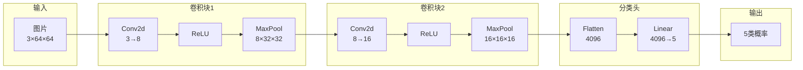
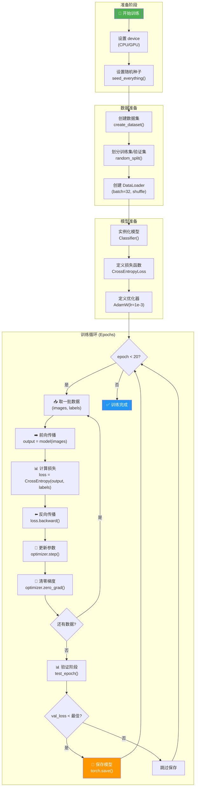

# 图像分类模型代码详解

## 📌 模型背景概览

| 项目 | 说明 |
|------|------|
| **模型类型** | CNN（卷积神经网络）图像分类 |
| **使用框架** | PyTorch |
| **输入形式** | RGB 图片（64×64 像素） |
| **输出形式** | 5 类标签（上衣、鞋、包、下身衣服、手表） |
| **任务目标** | 根据输入的时尚商品图片，预测其所属类别 |

---

## 🎯 模型整体做什么？解决什么问题？

这是一个 **时尚商品图像分类** 模型，目标是：

> **输入**：一张 64×64 的时尚商品 RGB 图片  
> **输出**：该图片属于 5 个类别中的哪一个

```
上衣(0) | 鞋(1) | 包(2) | 下身衣服(3) | 手表(4)
```

这类模型广泛应用于电商平台的商品自动分类、智能推荐等场景。

---

## 📁 代码文件结构

```
image_classification/
├── classification_config.py   # 配置文件（超参数、路径等）
├── classification_data.py     # 数据集加载与预处理
├── classification_model.py    # 模型定义（CNN 网络结构）
├── classification_engine.py   # 测试/验证引擎
├── classification_train.py    # 训练主程序
├── classification_test.py     # 测试脚本
└── classifier.pt              # 保存的模型权重

common/
├── engine.py                  # 通用训练引擎
└── utils.py                   # 工具函数（随机种子等）
```

---

## 🔍 关键模块详解

### 1️⃣ 配置文件 `classification_config.py`

> **作用**：集中管理所有超参数和配置，便于调整和实验。

```python
# 🔑 关键配置项
IMG_PATH = '../common/dataset/'          # 图片路径
FASHION_LABELS_PATH = '../common/fashion-labels.csv'  # 标签文件
IMG_H = 64                               # 图片高度
IMG_W = 64                               # 图片宽度

SEED = 42                                # 随机种子（保证可复现）
TRAIN_RATIO = 0.75                       # 训练集比例

# 🔧 训练超参数
LEARNING_RATE = 1e-3                     # 学习率
TRAIN_BATCH_SIZE = 32                    # 训练批次大小
VAL_BATCH_SIZE = 32                      # 验证批次大小
EPOCHS = 20                              # 训练轮数

# 📦 模型保存
CLASSIFIER_MODEL_NAME = 'classifier.pt'  # 模型权重文件名

# 🏷️ 分类标签映射
classification_names = {
    0: '上衣',
    1: '鞋',
    2: '包',
    3: '下身衣服',
    4: '手表'
}
```

> [!TIP]
> **如何修改超参数？**  
> 直接修改此文件中的值即可。例如：
> - 增加训练轮数：`EPOCHS = 50`
> - 调小学习率：`LEARNING_RATE = 1e-4`
> - 增大批次：`TRAIN_BATCH_SIZE = 64`

---

### 2️⃣ 数据集模块 `classification_data.py`

> **作用**：加载图片和标签，进行预处理，创建训练/验证数据集。

#### 核心类：`ImageLabelDataset`

```python
class ImageLabelDataset(Dataset):
    def __init__(self, main_dir, label_dir, transform=None):
        self.main_dir = main_dir
        self.transform = transform
        self.imgs = sorted_alphanum(os.listdir(main_dir))  # 按字母数字排序
        # 读取标签 CSV，转为字典
        labels = pd.read_csv(label_dir)
        self.labels_dict = dict(zip(labels['id'], labels['target']))

    def __len__(self):
        return len(self.imgs)

    def __getitem__(self, idx):
        # 1. 获取图片路径
        img_path = os.path.join(self.main_dir, self.imgs[idx])
        # 2. 加载并转为 RGB
        image = Image.open(img_path).convert('RGB')
        # 3. 应用预处理（resize + ToTensor）
        tensor_image = self.transform(image)
        # 4. 获取标签
        img_label = self.labels_dict[idx]
        return tensor_image, img_label
```

#### 数据集创建函数

```python
def create_dataset():
    transform = T.Compose([
        T.Resize((64, 64)),   # 统一尺寸
        T.ToTensor()          # 转为 Tensor，像素值归一化到 [0,1]
    ])
    dataset = ImageLabelDataset(IMG_PATH, FASHION_LABELS_PATH, transform)
    # 按比例划分训练集/验证集
    train_dataset, test_dataset = random_split(dataset, [TRAIN_RATIO, TEST_RATIO])
    return train_dataset, test_dataset
```

> [!IMPORTANT]
> **数据流向**：图片文件 → PIL 加载 → Resize 到 64×64 → 转为 Tensor → 送入模型

---

### 3️⃣ 模型定义 `classification_model.py` ⭐ 核心

> **作用**：定义 CNN 网络结构，这是整个分类器的"大脑"。

```python
class Classifier(nn.Module):
    def __init__(self, num_classes=5):
        super().__init__()
        self.model = nn.Sequential(
            # 第一个卷积块
            nn.Conv2d(3, 8, kernel_size=3, stride=1, padding=1),   # 输入3通道 → 8通道
            nn.ReLU(),                                              # 激活函数
            nn.MaxPool2d(2, 2),                                     # 池化，尺寸减半：64→32

            # 第二个卷积块
            nn.Conv2d(8, 16, kernel_size=3, stride=1, padding=1),  # 8通道 → 16通道
            nn.ReLU(),
            nn.MaxPool2d(2, 2),                                     # 池化，尺寸减半：32→16

            # 展平 + 全连接分类
            nn.Flatten(),                                           # 展平为一维向量
            nn.Linear(16 * 16 * 16, num_classes)                   # 全连接层输出5类
        )

    def forward(self, x):
        return self.model(x)
```

#### 网络结构可视化



#### 维度变化追踪

| 层 | 输入尺寸 | 输出尺寸 | 说明 |
|---|---------|---------|------|
| 输入 | - | (B, 3, 64, 64) | B=批次大小 |
| Conv2d(3→8) | (B, 3, 64, 64) | (B, 8, 64, 64) | 通道数增加 |
| MaxPool | (B, 8, 64, 64) | (B, 8, 32, 32) | 尺寸减半 |
| Conv2d(8→16) | (B, 8, 32, 32) | (B, 16, 32, 32) | 通道数增加 |
| MaxPool | (B, 16, 32, 32) | (B, 16, 16, 16) | 尺寸减半 |
| Flatten | (B, 16, 16, 16) | (B, 4096) | 展平 |
| Linear | (B, 4096) | (B, 5) | 输出5类 |

> [!TIP]
> **如何修改网络结构？**

````python
# 示例1：增加一个卷积层
self.model = nn.Sequential(
    nn.Conv2d(3, 8, kernel_size=3, stride=1, padding=1),
    nn.ReLU(),
    nn.MaxPool2d(2, 2),
    
    nn.Conv2d(8, 16, kernel_size=3, stride=1, padding=1),
    nn.ReLU(),
    nn.MaxPool2d(2, 2),
    
    # ✨ 新增第三个卷积块
    nn.Conv2d(16, 32, kernel_size=3, stride=1, padding=1),
    nn.ReLU(),
    nn.MaxPool2d(2, 2),  # 尺寸变为 8×8
    
    nn.Flatten(),
    nn.Linear(32 * 8 * 8, num_classes)  # 注意更新维度！
)
````

````python
# 示例2：更换激活函数（ReLU → LeakyReLU）
nn.Conv2d(3, 8, kernel_size=3, stride=1, padding=1),
nn.LeakyReLU(negative_slope=0.1),  # 替换 ReLU
nn.MaxPool2d(2, 2),
````

````python
# 示例3：添加 BatchNorm 层
nn.Conv2d(3, 8, kernel_size=3, stride=1, padding=1),
nn.BatchNorm2d(8),  # 在激活函数前添加
nn.ReLU(),
nn.MaxPool2d(2, 2),
````

---

### 4️⃣ 训练引擎 `common/engine.py`

> **作用**：封装单轮训练的核心逻辑，包含前向传播、损失计算、反向传播、参数更新。

```python
def train_epoch(model, train_loader, loss, optimizer, device):
    model.train()  # 🔑 设置为训练模式
    total_loss = 0

    for input, target in train_loader:
        input, target = input.to(device), target.to(device)
        
        # 1. 前向传播
        output = model(input)
        
        # 2. 计算损失
        loss_value = loss(output, target)
        
        # 3. 反向传播（计算梯度）
        loss_value.backward()
        
        # 4. 更新参数
        optimizer.step()
        
        # 5. 梯度清零（为下一批次准备）
        optimizer.zero_grad()

        total_loss += loss_value.item()
    
    return total_loss / len(train_loader)  # 返回平均损失
```

> [!IMPORTANT]
> **训练步骤记忆口诀**：**"前传-算损-反传-更新-清零"**
> 1. `output = model(input)` — 前向传播
> 2. `loss_value = loss(output, target)` — 计算损失
> 3. `loss_value.backward()` — 反向传播
> 4. `optimizer.step()` — 更新参数
> 5. `optimizer.zero_grad()` — 梯度清零

---

### 5️⃣ 验证引擎 `classification_engine.py`

> **作用**：在验证集上评估模型性能，计算损失和准确率。

```python
def test_epoch(model, test_loader, loss, device):
    model.eval()  # 🔑 设置为评估模式
    total_loss = 0
    correct_num = 0
    test_num = 0

    with torch.no_grad():  # 🔑 不计算梯度，节省内存
        for input, target in test_loader:
            input, target = input.to(device), target.to(device)
            
            output = model(input)
            loss_value = loss(output, target)
            
            total_loss += loss_value.item() * input.shape[0]
            test_num += input.shape[0]
            
            # 统计正确预测数
            pred = output.argmax(dim=1)  # 取最大概率的类别
            correct_num += pred.eq(target).sum().item()

    test_loss = total_loss / test_num
    accuracy = correct_num / test_num
    return test_loss, accuracy
```

> [!NOTE]
> `model.train()` vs `model.eval()` 的区别：
> - `train()`：启用 Dropout、BatchNorm 的训练行为
> - `eval()`：禁用 Dropout、BatchNorm 使用全局统计量

---

### 6️⃣ 训练主程序 `classification_train.py` ⭐ 入口

> **作用**：整合所有组件，执行完整的训练流程。

```python
if __name__ == '__main__':
    # 🔧 基本准备
    device = torch.device('cuda' if torch.cuda.is_available() else 'cpu')
    seed_everything(SEED)

    # 1️⃣ 创建数据集
    train_dataset, val_dataset = create_dataset()
    
    # 2️⃣ 创建数据加载器
    train_loader = DataLoader(train_dataset, TRAIN_BATCH_SIZE, shuffle=True, drop_last=True)
    val_loader = DataLoader(val_dataset, VAL_BATCH_SIZE, shuffle=False)
    
    # 3️⃣ 创建模型、损失函数、优化器
    classifier = Classifier()
    classifier.to(device)
    loss = nn.CrossEntropyLoss()  # 🔑 交叉熵损失（分类任务标配）
    optimizer = optim.AdamW(classifier.parameters(), lr=LEARNING_RATE)
    
    # 4️⃣ 训练循环
    min_val_loss = float('inf')
    for epoch in tqdm(range(EPOCHS)):
        # 训练一轮
        train_loss = train_epoch(classifier, train_loader, loss, optimizer, device)
        
        # 验证一轮
        val_loss, val_acc = test_epoch(classifier, val_loader, loss, device)
        
        # 保存最优模型
        if val_loss < min_val_loss:
            torch.save(classifier.state_dict(), CLASSIFIER_MODEL_NAME)
            min_val_loss = val_loss
```

---

## 🔄 模型训练流程图



---

## 🛠️ 实用修改示例

### 修改损失函数

```python
# 原始：交叉熵损失
loss = nn.CrossEntropyLoss()

# 选项1：带权重的交叉熵（处理类别不平衡）
weights = torch.tensor([1.0, 2.0, 1.5, 1.0, 3.0])  # 每类权重
loss = nn.CrossEntropyLoss(weight=weights.to(device))

# 选项2：Label Smoothing
loss = nn.CrossEntropyLoss(label_smoothing=0.1)

# 选项3：Focal Loss（需自定义）
class FocalLoss(nn.Module):
    def __init__(self, gamma=2.0):
        super().__init__()
        self.gamma = gamma
    
    def forward(self, pred, target):
        ce_loss = F.cross_entropy(pred, target, reduction='none')
        pt = torch.exp(-ce_loss)
        focal_loss = ((1 - pt) ** self.gamma * ce_loss).mean()
        return focal_loss

loss = FocalLoss(gamma=2.0)
```

### 修改优化器

```python
# 原始：AdamW
optimizer = optim.AdamW(classifier.parameters(), lr=LEARNING_RATE)

# 选项1：SGD + 动量
optimizer = optim.SGD(classifier.parameters(), lr=0.01, momentum=0.9)

# 选项2：Adam（无权重衰减）
optimizer = optim.Adam(classifier.parameters(), lr=1e-3)

# 选项3：带学习率调度器
optimizer = optim.AdamW(classifier.parameters(), lr=1e-3)
scheduler = optim.lr_scheduler.StepLR(optimizer, step_size=5, gamma=0.5)
# 在训练循环末尾添加：
# scheduler.step()

# 选项4：Cosine Annealing
scheduler = optim.lr_scheduler.CosineAnnealingLR(optimizer, T_max=EPOCHS)
```

### 添加数据增强

```python
# 在 classification_data.py 中修改 transform
transform = T.Compose([
    T.Resize((64, 64)),
    T.RandomHorizontalFlip(p=0.5),           # 随机水平翻转
    T.RandomRotation(degrees=10),             # 随机旋转
    T.ColorJitter(brightness=0.2, contrast=0.2),  # 颜色抖动
    T.ToTensor(),
    T.Normalize(mean=[0.485, 0.456, 0.406],  # ImageNet 标准化
                std=[0.229, 0.224, 0.225])
])
```

---

## 📝 关键代码总结

| 功能 | 文件 | 关键代码 |
|------|------|----------|
| 模型定义 | `classification_model.py` | `class Classifier(nn.Module)` |
| 数据加载 | `classification_data.py` | `class ImageLabelDataset(Dataset)` |
| 单轮训练 | `common/engine.py` | `def train_epoch()` |
| 单轮验证 | `classification_engine.py` | `def test_epoch()` |
| 损失函数 | `classification_train.py` | `nn.CrossEntropyLoss()` |
| 优化器 | `classification_train.py` | `optim.AdamW()` |
| 模型保存 | `classification_train.py` | `torch.save(classifier.state_dict(), ...)` |

---

## 🎓 学习建议

1. **先跑通代码**：确保代码能正常运行，观察训练过程
2. **调参实验**：修改 `classification_config.py` 中的超参数，观察效果
3. **修改模型**：尝试增删卷积层，观察准确率变化
4. **添加功能**：集成 TensorBoard 可视化训练过程
5. **模型评估**：使用 `classification_test.py` 在新数据上测试

> [!CAUTION]
> 修改网络结构后，一定要检查维度是否匹配！可以用测试代码验证：
> ```python
> x = torch.randn(1, 3, 64, 64)
> model = Classifier()
> print(model(x).shape)  # 应输出 torch.Size([1, 5])
> ```
