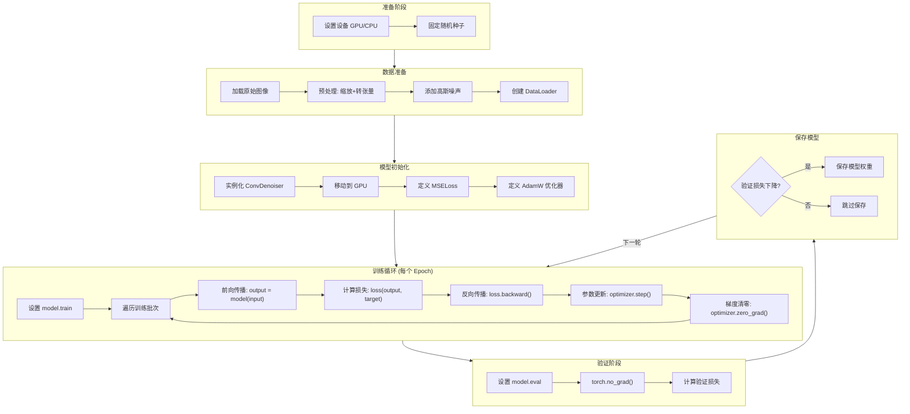

# 图像去噪自编码器模型代码讲解

## 一、模型背景概览

| 项目 | 说明 |
|------|------|
| **模型类型** | CNN 卷积去噪自编码器（Convolutional Denoising Autoencoder） |
| **使用框架** | PyTorch |
| **输入** | 带噪声的 RGB 图像，尺寸 68×68，张量形状 `[B, 3, 68, 68]` |
| **输出** | 去噪后的 RGB 图像，张量形状与输入相同 |
| **解决的问题** | 从加入高斯噪声的图像中恢复出干净的原始图像 |

---

## 二、项目文件结构与各模块作用

```
image_denoising/
├── denoising_config.py   # 配置参数（路径、超参数等）
├── denoising_data.py     # 数据集处理（加载、噪声添加、划分）
├── denoising_model.py    # 模型定义（去噪自编码器网络结构）
├── denoising_engine.py   # 训练引擎（单轮训练与测试函数）  ← 你打开的文件
├── denoising_train.py    # 训练主流程（完整训练脚本）
├── denoising_test.py     # 测试/推理脚本
└── denoiser.pt           # 保存的模型权重文件
```

---

## 三、核心模块详解

### 3.1 配置模块 `denoising_config.py`

这个文件集中管理所有可调参数，方便修改实验配置：

```python
# 数据配置
IMG_PATH = '../common/dataset/'   # 图像数据目录
IMG_H = 68                        # 图像高度
IMG_W = 68                        # 图像宽度

# 随机性配置
SEED = 42                         # 随机种子（保证可复现）
TRAIN_RATIO = 0.75                # 训练集比例
NOISE_RATIO = 0.5                 # 噪声强度因子 ← 【可调】

# 训练超参数
LEARNING_RATE = 1e-3              # 学习率 ← 【可调】
TRAIN_BATCH_SIZE = 32             # 批大小 ← 【可调】
EPOCHS = 30                       # 训练轮数 ← 【可调】
```

> [!TIP]
> **修改建议**：如果训练效果不好，可以尝试：
> - 降低 `NOISE_RATIO`（0.3~0.5）
> - 调整 `LEARNING_RATE`（1e-4 ~ 1e-2）
> - 增加 `EPOCHS`

---

### 3.2 数据处理模块 `denoising_data.py`

#### 核心功能
1. **加载图像** → 2. **预处理（缩放+转张量）** → 3. **添加噪声** → 4. **划分训练/测试集**

#### 关键代码：自定义数据集类

```python
class ImageDataset(Dataset):
    def __init__(self, main_dir, transform=None):
        self.main_dir = main_dir
        self.transform = transform
        self.imgs = sorted_alphanum(os.listdir(main_dir))  # 获取图片列表

    def __getitem__(self, idx):
        # 1. 加载图像
        img_path = os.path.join(self.main_dir, self.imgs[idx])
        image = Image.open(img_path).convert('RGB')
        
        # 2. 预处理转换
        tensor_image = self.transform(image)
        
        # 3. ★ 添加高斯噪声 ★
        noisy_image = tensor_image + torch.randn_like(tensor_image) * NOISE_RATIO
        noisy_image = torch.clamp(noisy_image, 0., 1.)  # 裁剪到[0,1]
        
        return noisy_image, tensor_image  # (输入: 噪声图, 目标: 干净图)
```

> [!IMPORTANT]
> **核心思想**：去噪模型的训练数据是"自监督"的——用原图作为标签，人工添加噪声作为输入。

---

### 3.3 模型定义模块 `denoising_model.py`  ⭐核心⭐

#### 自编码器结构图

```mermaid
flowchart LR
    subgraph Input
        A["噪声图像<br/>3×68×68"]
    end
    
    subgraph Encoder["编码器 (压缩)"]
        E1["Conv2d 3→32<br/>+ ReLU + MaxPool"]
        E2["Conv2d 32→16<br/>+ ReLU + MaxPool"]
        E3["Conv2d 16→8<br/>+ ReLU + MaxPool"]
    end
    
    subgraph Latent
        L["潜在表示<br/>8×8×8"]
    end
    
    subgraph Decoder["解码器 (重建)"]
        D1["ConvTranspose 8→8<br/>+ ReLU"]
        D2["ConvTranspose 8→16<br/>+ ReLU"]
        D3["ConvTranspose 16→32<br/>+ ReLU"]
        D4["Conv2d 32→3<br/>+ Sigmoid"]
    end
    
    subgraph Output
        O["去噪图像<br/>3×68×68"]
    end
    
    A --> E1 --> E2 --> E3 --> L --> D1 --> D2 --> D3 --> D4 --> O
```



#### 关键代码：模型网络结构

```python
class ConvDenoiser(nn.Module):
    def __init__(self):
        super().__init__()
        
        # ========== 编码器：提取特征 + 降维 ==========
        self.encoder = nn.Sequential(
            # 第1层：3通道 → 32通道
            nn.Conv2d(3, 32, kernel_size=3, stride=1, padding=1),
            nn.ReLU(),                          # ← 激活函数【可替换】
            nn.MaxPool2d(kernel_size=2, stride=2),  # 尺寸减半
            
            # 第2层：32通道 → 16通道
            nn.Conv2d(32, 16, kernel_size=3, stride=1, padding=1),
            nn.ReLU(),
            nn.MaxPool2d(kernel_size=2, stride=2),
            
            # 第3层：16通道 → 8通道
            nn.Conv2d(16, 8, kernel_size=3, stride=1, padding=1),
            nn.ReLU(),
            nn.MaxPool2d(kernel_size=2, stride=2),
        )
        
        # ========== 解码器：上采样 + 重建图像 ==========
        self.decoder = nn.Sequential(
            nn.ConvTranspose2d(8, 8, kernel_size=3, stride=2),
            nn.ReLU(),
            nn.ConvTranspose2d(8, 16, kernel_size=2, stride=2),
            nn.ReLU(),
            nn.ConvTranspose2d(16, 32, kernel_size=2, stride=2),
            nn.ReLU(),
            # 最后一层输出3通道，用Sigmoid限制到[0,1]
            nn.Conv2d(32, 3, kernel_size=3, stride=1, padding=1),
            nn.Sigmoid()  # 输出范围[0,1]，对应图像像素值
        )
    
    def forward(self, x):
        x = self.encoder(x)  # 压缩
        x = self.decoder(x)  # 重建
        return x
```

> [!NOTE]
> **网络设计思路**：
> - **编码器**：逐层减少空间尺寸、增加通道深度，提取抽象特征
> - **解码器**：逐层恢复空间尺寸，重建图像
> - **Sigmoid**：输出层用 Sigmoid 保证输出在 [0,1]，与图像像素值范围一致

---

### 3.4 训练引擎模块 `denoising_engine.py`（你正在查看的文件）

#### 训练函数 `train_epoch`

```python
def train_epoch(model, train_loader, loss, optimizer, device):
    model.train()  # 设置为训练模式
    total_loss = 0

    for input, target in train_loader:
        input, target = input.to(device), target.to(device)
        
        # ★ 训练循环核心5步骤 ★
        output = model(input)           # 1. 前向传播
        loss_value = loss(output, target)  # 2. 计算损失
        loss_value.backward()           # 3. 反向传播（计算梯度）
        optimizer.step()                # 4. 更新参数
        optimizer.zero_grad()           # 5. 梯度清零
        
        total_loss += loss_value.item()
    
    return total_loss / len(train_loader)  # 返回平均损失
```

#### 测试/验证函数 `test_epoch`

```python
def test_epoch(model, test_loader, loss, device):
    model.eval()  # 设置为评估模式（禁用Dropout等）
    total_loss = 0

    with torch.no_grad():  # ★ 关闭梯度计算，节省内存 ★
        for input, target in test_loader:
            input, target = input.to(device), target.to(device)
            output = model(input)
            loss_value = loss(output, target)
            total_loss += loss_value.item()
    
    return total_loss / len(test_loader)
```

> [!CAUTION]
> **常见错误**：忘记在验证时使用 `torch.no_grad()`，会导致内存溢出。

---

### 3.5 训练主流程 `denoising_train.py`

```python
# === 准备工作 ===
device = torch.device('cuda' if torch.cuda.is_available() else 'cpu')
seed_everything(SEED)  # 固定随机种子

# === 1. 创建数据集和加载器 ===
train_dataset, val_dataset = create_dataset()
train_loader = DataLoader(train_dataset, batch_size=TRAIN_BATCH_SIZE, shuffle=True)
val_loader = DataLoader(val_dataset, batch_size=VAL_BATCH_SIZE)

# === 2. 初始化模型、损失函数、优化器 ===
denoiser = ConvDenoiser().to(device)
loss = nn.MSELoss()      # 均方误差损失 ← 【可替换】
optimizer = optim.AdamW(denoiser.parameters(), lr=LEARNING_RATE)  # ← 【可替换】

# === 3. 训练循环 ===
min_val_loss = float('inf')  # 记录最佳验证损失

for epoch in range(EPOCHS):
    train_loss = train_epoch(denoiser, train_loader, loss, optimizer, device)
    val_loss = test_epoch(denoiser, val_loader, loss, device)
    
    # ★ 保存最佳模型 ★
    if val_loss < min_val_loss:
        torch.save(denoiser.state_dict(), DENOISER_MODEL_NAME)
        min_val_loss = val_loss
```

---

## 四、模型训练完整流程图



---

## 五、如何进行简单修改

### 5.1 修改网络结构

#### 示例1：增加一层卷积

在 `denoising_model.py` 的编码器中添加：

```python
self.encoder = nn.Sequential(
    nn.Conv2d(3, 64, kernel_size=3, stride=1, padding=1),   # 新增层
    nn.ReLU(),
    nn.MaxPool2d(kernel_size=2, stride=2),
    
    nn.Conv2d(64, 32, kernel_size=3, stride=1, padding=1),  # 修改输入通道
    nn.ReLU(),
    nn.MaxPool2d(kernel_size=2, stride=2),
    # ... 后续层需相应调整通道数
)
```

#### 示例2：更换激活函数

```python
# 原来
nn.ReLU()

# 替换为 LeakyReLU（解决 ReLU 神经元死亡问题）
nn.LeakyReLU(0.2)

# 或替换为 GELU（Transformer 常用）
nn.GELU()
```

---

### 5.2 修改/替换损失函数

在 `denoising_train.py` 中修改：

```python
# 原来：均方误差损失
loss = nn.MSELoss()

# 替换为 L1 Loss（MAE，对异常值更鲁棒）
loss = nn.L1Loss()

# 替换为 Smooth L1 Loss（结合 MSE 和 L1 的优点）
loss = nn.SmoothL1Loss()

# 自定义组合损失（MSE + 感知损失）
class CombinedLoss(nn.Module):
    def __init__(self):
        super().__init__()
        self.mse = nn.MSELoss()
        self.l1 = nn.L1Loss()
    
    def forward(self, output, target):
        return self.mse(output, target) + 0.1 * self.l1(output, target)

loss = CombinedLoss()
```

---

### 5.3 更换/调整优化器

在 `denoising_train.py` 中修改：

```python
# 原来：AdamW
optimizer = optim.AdamW(denoiser.parameters(), lr=LEARNING_RATE)

# 替换为 SGD + 动量
optimizer = optim.SGD(denoiser.parameters(), lr=0.01, momentum=0.9)

# 替换为 Adam（无权重衰减）
optimizer = optim.Adam(denoiser.parameters(), lr=1e-3, betas=(0.9, 0.999))

# 添加学习率调度器
scheduler = optim.lr_scheduler.StepLR(optimizer, step_size=10, gamma=0.5)

# 在训练循环中添加：
for epoch in range(EPOCHS):
    train_loss = train_epoch(...)
    val_loss = test_epoch(...)
    scheduler.step()  # 每10轮学习率减半
```

---

## 六、关键代码速查表

| 功能 | 文件 | 关键代码 |
|------|------|----------|
| 添加噪声 | `denoising_data.py:45` | `noisy_image = tensor_image + torch.randn_like(tensor_image) * NOISE_RATIO` |
| 前向传播 | `denoising_engine.py:14` | `output = model(input)` |
| 计算损失 | `denoising_engine.py:16` | `loss_value = loss(output, target)` |
| 反向传播 | `denoising_engine.py:18` | `loss_value.backward()` |
| 参数更新 | `denoising_engine.py:20` | `optimizer.step()` |
| 保存模型 | `denoising_train.py:50` | `torch.save(denoiser.state_dict(), DENOISER_MODEL_NAME)` |

---

## 七、总结

这是一个经典的 **卷积去噪自编码器**，核心思想是：

1. **自监督学习**：用原图作为标签，人工添加噪声生成输入
2. **编码器-解码器结构**：先压缩提取特征，再重建图像
3. **端到端训练**：模型学习"噪声图 → 干净图"的映射

掌握这个代码后，你可以轻松扩展到：
- 图像超分辨率（低分辨率 → 高分辨率）
- 图像修复（遮挡 → 完整）
- 图像风格迁移
