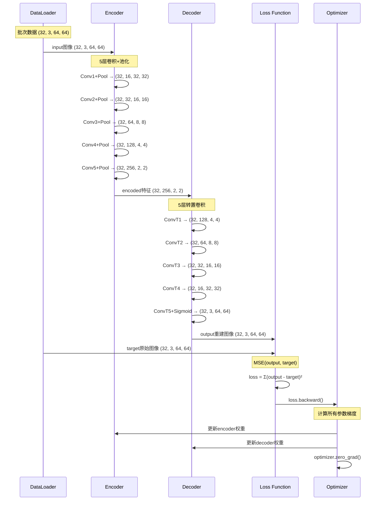

# 图像相似度检索系统代码详解

## 📌 一、模型背景快速了解

- **模型类型**：卷积自编码器（Convolutional Autoencoder）+ 基于余弦相似度的KNN检索
- **使用框架**：PyTorch
- **核心任务**：图像相似度检索（Image Similarity Search）
- **输入输出**：
  - 输入：64×64 RGB图像
  - 中间产物：1024维特征向量（embedding）
  - 输出：最相似的K张图片索引

---

## 🎯 二、整体目标：这个系统在做什么？

### 问题场景
想象你有一个图片库（比如电商商品图、设计素材库），用户上传一张图片，你需要快速找到库中**最相似**的图片。

### 解决方案
这个系统分两个阶段：

**阶段1：训练阶段（similarity_train.py）**
```
原始图片 → 编码器(压缩) → 特征向量 → 解码器(还原) → 重建图片
         ↓
    通过重建误差训练，让编码器学会提取图像的"精华特征"
```

**阶段2：检索阶段（similarity_test.py）**
```
查询图片 → 编码器 → 查询向量
                      ↓
            与数据库中所有向量计算相似度 → 返回Top-K最相似图片
```

### 核心思想
- **自编码器**：通过"压缩-还原"任务，强迫模型学习图像的关键特征
- **特征向量**：把图像压缩成1024维向量，保留视觉语义信息
- **相似度计算**：用余弦相似度衡量两张图片的接近程度

---

## 🧩 三、关键模块详解

### 模块1：配置文件（similarity_config.py）

**作用**：集中管理所有超参数，方便调参实验

```python
# 🔑 关键配置项
IMG_H = 64              # 图像尺寸：影响计算量和细节保留
IMG_W = 64              
LEARNING_RATE = 1e-3    # 学习率：太大不收敛，太小训练慢
TRAIN_BATCH_SIZE = 32   # 批大小：影响内存和梯度稳定性
EPOCHS = 30             # 训练轮数：根据验证损失曲线决定
```

**💡 快速修改技巧**：
- 想提高图像质量？改 `IMG_H/IMG_W` 为 128
- 训练不稳定？降低 `LEARNING_RATE` 到 5e-4
- 显存不足？减小 `TRAIN_BATCH_SIZE` 到 16

---

### 模块2：数据处理（similarity_data.py）

**作用**：加载图像数据，转换为PyTorch张量

```python
class ImageDataset(Dataset):
    def __getitem__(self, idx):
        # 加载图像
        image = Image.open(img_path).convert('RGB')
        # 🔑 关键：自编码器的标签就是输入本身
        tensor_image = self.transform(image)
        return tensor_image, tensor_image  # (输入, 目标) 都是同一张图
```

**核心概念**：
- 自编码器是**无监督学习**，不需要人工标注
- 数据增强可以在 `transform` 中添加（如随机翻转、颜色抖动）

**🎨 数据增强示例**：
```python
transform = T.Compose([
    T.Resize((IMG_H, IMG_W)),
    T.RandomHorizontalFlip(p=0.5),      # 新增：随机水平翻转
    T.ColorJitter(brightness=0.2),      # 新增：亮度抖动
    T.ToTensor()
])
```

---

### 模块3：模型架构（similarity_model.py）⭐

#### 3.1 编码器（ConvEncoder）
**作用**：把 64×64×3 的图像压缩成 2×2×256 的特征图

```python
class ConvEncoder(nn.Module):
    def __init__(self):
        super().__init__()
        # 🔑 5层卷积，每层后接最大池化（尺寸减半）
        self.conv1 = nn.Conv2d(3, 16, kernel_size=3, padding=1)    # 64×64×3  → 64×64×16
        self.pool = nn.MaxPool2d(2, stride=2)                       # 64×64×16 → 32×32×16
        self.conv2 = nn.Conv2d(16, 32, kernel_size=3, padding=1)   # 32×32×16 → 32×32×32
        # ... 以此类推
        self.conv5 = nn.Conv2d(128, 256, kernel_size=3, padding=1) # 4×4×128  → 4×4×256
        # 最终输出：2×2×256 = 1024维特征
```

**维度变化轨迹**：
```
输入: (N, 3, 64, 64)
  ↓ conv1+relu → (N, 16, 64, 64)
  ↓ pool       → (N, 16, 32, 32)
  ↓ conv2+relu → (N, 32, 32, 32)
  ↓ pool       → (N, 32, 16, 16)
  ↓ conv3+relu → (N, 64, 16, 16)
  ↓ pool       → (N, 64, 8, 8)
  ↓ conv4+relu → (N, 128, 8, 8)
  ↓ pool       → (N, 128, 4, 4)
  ↓ conv5+relu → (N, 256, 4, 4)
  ↓ pool       → (N, 256, 2, 2)  ← 编码器输出（特征向量）
```

#### 3.2 解码器（ConvDecoder）
**作用**：把 2×2×256 的特征图还原成 64×64×3 的图像

```python
class ConvDecoder(nn.Module):
    def __init__(self):
        super().__init__()
        # 🔑 转置卷积（反卷积），每层尺寸翻倍
        self.conv_t1 = nn.ConvTranspose2d(256, 128, kernel_size=2, stride=2)  # 2×2 → 4×4
        # ...
        self.conv_t5 = nn.ConvTranspose2d(16, 3, kernel_size=2, stride=2)     # 32×32 → 64×64
    
    def forward(self, x):
        # ...
        x = torch.sigmoid(self.conv_t5(x))  # 🔑 Sigmoid限制输出在[0,1]，匹配图像像素范围
        return x
```

**🔧 修改网络结构示例**：

**增加网络深度（提取更抽象特征）**：
```python
# 在编码器中增加一层
self.conv6 = nn.Conv2d(256, 512, kernel_size=3, padding=1)

# forward中添加
x = torch.relu(self.conv5(x))
x = self.pool(x)  # 现在是 1×1×512
x = torch.relu(self.conv6(x))
```

**更换激活函数**：
```python
# 把所有ReLU换成LeakyReLU（缓解神经元死亡）
x = torch.nn.functional.leaky_relu(self.conv1(x), negative_slope=0.2)
```

---

### 模块4：训练引擎（similarity_engine.py）

#### 4.1 训练一个Epoch
```python
def train_epoch(encoder, decoder, train_loader, loss, optimizer, device):
    encoder.train()  # 🔑 开启训练模式（启用Dropout/BatchNorm训练行为）
    decoder.train()
    
    for input, target in train_loader:
        # 🔑 自编码器的5步训练循环
        encoded_feature = encoder(input)       # 1. 编码
        output = decoder(encoded_feature)      # 2. 解码
        loss_value = loss(output, target)      # 3. 计算重建误差
        loss_value.backward()                  # 4. 反向传播
        optimizer.step()                       # 5. 更新参数
        optimizer.zero_grad()                  # 6. 清零梯度（准备下一批）
```

**💡 损失函数选择**：
- **MSE（当前使用）**：适合像素级重建，但可能过于关注细节
- **改用感知损失**（需额外代码）：
```python
# 使用预训练VGG提取特征，比较高层语义
import torchvision.models as models
vgg = models.vgg16(pretrained=True).features[:16]

def perceptual_loss(output, target):
    output_features = vgg(output)
    target_features = vgg(target)
    return nn.MSELoss()(output_features, target_features)
```

#### 4.2 生成图像嵌入矩阵
```python
def create_embeddings(encoder, full_loader, device):
    embeddings = torch.empty(0)
    
    for input, target in full_loader:
        output = encoder(input).cpu()  # 只用编码器，输出 (N, 256, 2, 2)
        embeddings = torch.cat((embeddings, output), dim=0)  # 拼接所有批次
    
    # 🔑 展平为二维矩阵：(总图片数, 1024)
    embeddings = embeddings.reshape(embeddings.shape[0], -1).numpy()
    return embeddings
```

**用途**：构建"图像向量数据库"，用于快速检索

#### 4.3 相似图像检索
```python
def compute_similar_images(encoder, image_tensor, num_images, embeddings, device):
    # 1. 编码查询图像
    image_embedding = encoder(image_tensor).cpu().numpy()
    image_vector = image_embedding.reshape((1, -1))  # 变成 (1, 1024)
    
    # 2. 🔑 使用KNN算法，基于余弦相似度查找最近邻
    knn = NearestNeighbors(n_neighbors=num_images, metric='cosine')
    knn.fit(embeddings)  # 在整个数据库上建立索引
    _, indices = knn.kneighbors(image_vector)  # 返回最近的K个索引
    
    return indices.tolist()
```

**相似度度量选择**：
- `cosine`：余弦相似度，关注方向，不受向量长度影响
- `euclidean`：欧氏距离，关注绝对位置
- `manhattan`：曼哈顿距离，计算更快

---

### 模块5：训练主流程（similarity_train.py）

```python
if __name__ == '__main__':
    # 步骤1：准备数据
    dataset, train_dataset, val_dataset = create_dataset()
    train_loader = DataLoader(train_dataset, batch_size=32, shuffle=True)
    
    # 步骤2：初始化模型
    encoder = ConvEncoder().to(device)
    decoder = ConvDecoder().to(device)
    
    # 步骤3：定义损失和优化器
    loss = nn.MSELoss()  # 🔑 均方误差，衡量重建质量
    params = list(encoder.parameters()) + list(decoder.parameters())
    optimizer = optim.AdamW(params, lr=1e-3)  # 🔑 AdamW带权重衰减，防止过拟合
    
    # 步骤4：训练循环
    for epoch in range(EPOCHS):
        train_loss = train_epoch(...)
        val_loss = test_epoch(...)
        
        # 🔑 早停逻辑：验证损失下降时保存模型
        if val_loss < min_val_loss:
            torch.save(encoder.state_dict(), 'encoder.pt')
            min_val_loss = val_loss
    
    # 步骤5：生成嵌入矩阵
    embeddings = create_embeddings(encoder, full_loader, device)
    np.save('embeddings.npy', embeddings)  # 保存为"向量数据库"
```

**🔧 优化器替换示例**：
```python
# 方案1：使用SGD+动量（更稳定但可能慢）
optimizer = optim.SGD(params, lr=1e-3, momentum=0.9, weight_decay=1e-4)

# 方案2：使用RAdam（自适应调整学习率）
optimizer = optim.RAdam(params, lr=1e-3)

# 方案3：添加学习率调度器
scheduler = optim.lr_scheduler.ReduceLROnPlateau(
    optimizer, mode='min', factor=0.5, patience=5
)
# 在训练循环中：
scheduler.step(val_loss)  # 验证损失不下降时自动降低学习率
```

---

## 📊 四、训练流程可视化

### 完整训练流程图

```mermaid
graph TB
    A[开始训练] --> B[加载图像数据集]
    B --> C["数据预处理<br/>Resize + ToTensor"]
    C --> D["划分训练集/验证集<br/>75% / 25%"]
    D --> E["创建DataLoader<br/>batch_size=32"]
    
    E --> F[初始化模型]
    %% 下面两行加了双引号 "" 修复报错
    F --> F1["编码器ConvEncoder<br/>3→16→32→64→128→256通道"]
    F --> F2["解码器ConvDecoder<br/>256→128→64→32→16→3通道"]
    
    F1 --> G[设置训练组件]
    F2 --> G
    G --> G1["损失函数: MSELoss"]
    G --> G2["优化器: AdamW"]
    
    G1 --> H{开始Epoch循环}
    G2 --> H
    
    H --> I[训练阶段]
    I --> I1["从DataLoader取一批数据<br/>input, target = batch"]
    I --> I2["前向传播<br/>encoded = encoder input<br/>output = decoder encoded"]
    I2 --> I3["计算损失<br/>loss = MSE output, target"]
    I3 --> I4["反向传播<br/>loss.backward"]
    I4 --> I5["更新参数<br/>optimizer.step"]
    I5 --> I6["清零梯度<br/>optimizer.zero_grad"]
    I6 --> I7{还有批次?}
    I7 -->|是| I1
    I7 -->|否| J[计算训练平均损失]
    
    J --> K[验证阶段]
    K --> K1["设置模型为评估模式<br/>encoder.eval decoder.eval"]
    K1 --> K2["关闭梯度计算<br/>with torch.no_grad"]
    K2 --> K3[在验证集上前向传播]
    K3 --> K4[计算验证损失]
    
    K4 --> L{验证损失<br/>是否下降?}
    L -->|是| M["保存模型参数<br/>encoder.pt<br/>decoder.pt"]
    L -->|否| N[不保存模型]
    
    M --> O{达到最大<br/>Epoch数?}
    N --> O
    O -->|否| H
    O -->|是| P[训练完成]
    
    P --> Q[生成嵌入矩阵阶段]
    Q --> Q1[加载最优编码器]
    Q1 --> Q2["遍历完整数据集<br/>full_loader"]
    Q2 --> Q3["对每张图生成embedding<br/>output = encoder image<br/>shape: 256,2,2"]
    Q3 --> Q4["展平为向量<br/>reshape to 1024"]
    Q4 --> Q5["拼接所有向量<br/>得到 N,1024 矩阵"]
    Q5 --> Q6["保存为embeddings.npy<br/>向量数据库"]
    Q6 --> R[结束]
    
    style I fill:#e1f5ff
    style K fill:#fff4e1
    style Q fill:#f0e1ff
    style M fill:#c8e6c9
```


### 单次迭代详细流程


---

## 🎓 五、进阶改进方向

### 1. 模型结构改进
```python
# 🔥 添加批归一化（稳定训练）
class ConvEncoder(nn.Module):
    def __init__(self):
        super().__init__()
        self.conv1 = nn.Conv2d(3, 16, 3, padding=1)
        self.bn1 = nn.BatchNorm2d(16)  # 新增
        # ...
    
    def forward(self, x):
        x = self.bn1(torch.relu(self.conv1(x)))  # 在激活后加BN
        x = self.pool(x)
        # ...
```

### 2. 损失函数改进
```python
# 🔥 组合损失：MSE + 感知损失
class CombinedLoss(nn.Module):
    def __init__(self):
        super().__init__()
        self.mse = nn.MSELoss()
        self.l1 = nn.L1Loss()
    
    def forward(self, output, target):
        mse_loss = self.mse(output, target)
        l1_loss = self.l1(output, target)
        return 0.7 * mse_loss + 0.3 * l1_loss  # 加权组合
```

### 3. 检索效率优化
```python
# 🔥 使用Faiss加速大规模检索（百万级图片）
import faiss

# 构建索引
index = faiss.IndexFlatIP(1024)  # 内积索引（余弦相似度）
index.add(embeddings.astype('float32'))

# 快速检索
D, I = index.search(query_vector, k=5)  # 返回距离和索引
```

---

## 📝 六、常见问题

### Q1: 训练损失不下降怎么办？
```python
# 检查清单：
1. 学习率是否过大/过小？试试 [1e-4, 1e-3, 1e-2]
2. 梯度是否爆炸？添加梯度裁剪
   torch.nn.utils.clip_grad_norm_(model.parameters(), max_norm=1.0)
3. 数据是否归一化？检查图像值是否在 [0, 1]
```

### Q2: 检索结果不准确？
```python
# 解决方案：
1. 增加训练Epoch，确保模型充分收敛
2. 扩大数据集，提高模型泛化能力
3. 调整嵌入维度（增加Conv5输出通道数）
4. 尝试不同的相似度度量（cosine/euclidean）
```

### Q3: 显存不足？
```python
# 优化策略：
1. 减小batch_size：32 → 16 → 8
2. 降低图像分辨率：64 → 32
3. 减少网络层数（删除conv5/conv_t5）
4. 使用梯度累积（模拟大batch）
```

---

## 🚀 七、实战演练任务

### 任务1：修改网络深度
在编码器中增加第6层卷积，输出512通道，观察效果

### 任务2：替换激活函数
把所有ReLU换成GELU或Swish

### 任务3：实现三元组损失
使用Triplet Loss训练编码器，直接优化embedding空间

### 任务4：添加数据增强
在数据预处理中加入RandomRotation、RandomCrop

---

## 📚 八、关键代码速查表

| 功能 | 代码位置 | 关键参数 |
|------|---------|---------|
| 修改图像尺寸 | `similarity_config.py` | `IMG_H`, `IMG_W` |
| 调整学习率 | `similarity_config.py` | `LEARNING_RATE` |
| 更换优化器 | `similarity_train.py` L43 | `optim.AdamW(...)` |
| 修改网络层数 | `similarity_model.py` | 增删`conv`层 |
| 更换损失函数 | `similarity_train.py` L41 | `nn.MSELoss()` |
| 调整检索数量 | `similarity_test.py` L23 | `num_similar` |
| 更换相似度度量 | `similarity_engine.py` L62 | `metric='cosine'` |

---

**🎉 恭喜！你现在已经掌握了这个图像相似度检索系统的核心原理和改进方法！**